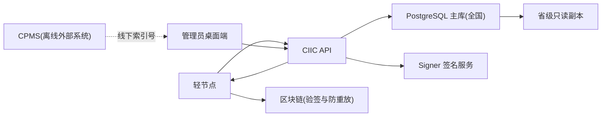

# CIIC 架构评审稿（V1）

## 1. 目标与范围
- 目标：建设独立 CIIC 系统，支持人工绑定、自动投票资格凭证、全量审计。
- 范围：CIIC 桌面端、CIIC API、签名服务、数据库、权限与容灾。
- 非范围：CPMS 内部实现、区块链代码改造。

## 2. 核心业务结论
1. 绑定流程是人工操作：
- 轻节点提交公钥申请
- 管理员线下获取 CPMS 档案索引号
- 在 CIIC 系统手工录入并确认绑定

2. 投票资格验证是自动操作：
- 轻节点发起投票请求
- CIIC 自动核验绑定状态并签发投票凭证

3. 绑定与解绑均需管理员执行：
- 不提供用户自助解绑
- 解绑必须记录原因与审计日志

## 3. 技术栈
- 管理端：`Tauri + React + TypeScript + Vite + Ant Design + 自定义主题`
- API 服务：`Rust + Axum`
- 签名服务：`Rust (Signer 独立进程)`
- 数据库：`PostgreSQL`（全国主库 + 省级只读副本）
- 缓存/限流：`Redis`（可选）

## 4. 逻辑架构

## 5. 组织与权限模型
1. 组织层级
- `NATIONAL`：国家超级管理员
- `PROVINCE`：省级管理员
- `CITY_BUREAU`：市护照局管理员

2. 数据作用域
- 使用 `province_code + city_code` 做访问域控制
- 一个市对应一个护照管理局，不单独拆 bureau 实体

3. 角色建议
- `system_admin`（系统配置、密钥策略）
- `operator`（录入）
- `reviewer`（复核）
- `auditor`（审计只读）

4. 安全策略
- 登录：密码 + 2FA
- 高风险操作：双人复核（可配置）
- 全部关键操作审计留痕

## 6. 核心流程
### 6.1 绑定流程
1. `POST /bind/request` 创建申请
2. 管理员打开工单，手工输入 `archive_index`
3. 系统做唯一性校验：索引号唯一、公钥唯一
4. 系统生成 `ciic_code` 并写入绑定关系
5. 系统签发绑定凭证，轻节点拿凭证上链绑定

### 6.2 解绑流程
1. 管理员发起解绑
2. 复核员确认（可配置）
3. 状态更新为 `UNBOUND`
4. 写审计日志

### 6.3 投票凭证流程
1. 轻节点 `POST /vote/credential`
2. 系统检查绑定状态 `ACTIVE`
3. signer 生成 `nonce + signature`
4. 返回投票凭证供链上验签

## 7. 数据模型总览
1. `bind_requests`：绑定申请工单
2. `archive_bindings`：索引号、公钥、ciic_code 绑定关系
3. `credential_issues`：绑定/投票凭证签发记录
4. `admin_users`：管理员账户与组织层级
5. `audit_logs`：全量审计记录

关键唯一约束：
- `archive_bindings.archive_index` 唯一
- `archive_bindings.account_pubkey` 唯一
- `archive_bindings.ciic_code` 唯一（建议加）

## 8. 对接边界（与区块链）
- CIIC 输出：`identity_hash/ciic_code + nonce + signature + key_id + expired_at`
- 区块链接收并验签，负责链上防重放
- CIIC 不写链，不依赖链内私有实现

## 9. 数据库与容灾
1. 写入路径
- 所有写操作只写全国主库

2. 查询路径
- 省内查询与报表默认走本省只读副本

3. 抗故障策略
- 主库 HA 自动切换
- 省级副本读容灾
- 定期备份 + 恢复演练

## 10. 非功能指标（建议）
- API 可用性：`>= 99.9%`
- 凭证签发延迟：P95 `< 300ms`
- 关键接口限流：按 IP + 账号 + 设备维度
- 审计日志保留：不少于 3 年

## 11. 里程碑
1. M1：人工绑定闭环（2-3 周）
2. M2：自动投票凭证闭环（2 周）
3. M3：安全与运维增强（2 周）

## 12. 评审结论清单
- [ ] 组织权限模型确认
- [ ] 绑定/解绑审批规则确认
- [ ] CPMS 外部依赖边界确认
- [ ] API 字段冻结
- [ ] DB 约束冻结
- [ ] 容灾拓扑确认
- [ ] 前端组件库与主题规范冻结（Ant Design + CIIC 自定义主题）
