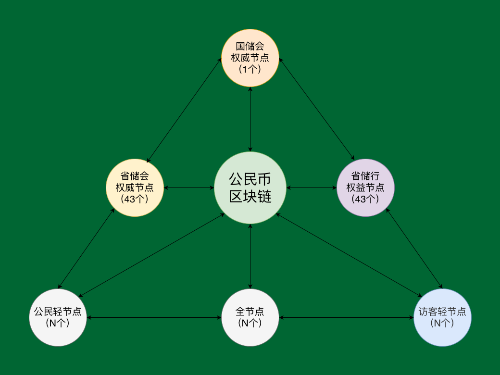
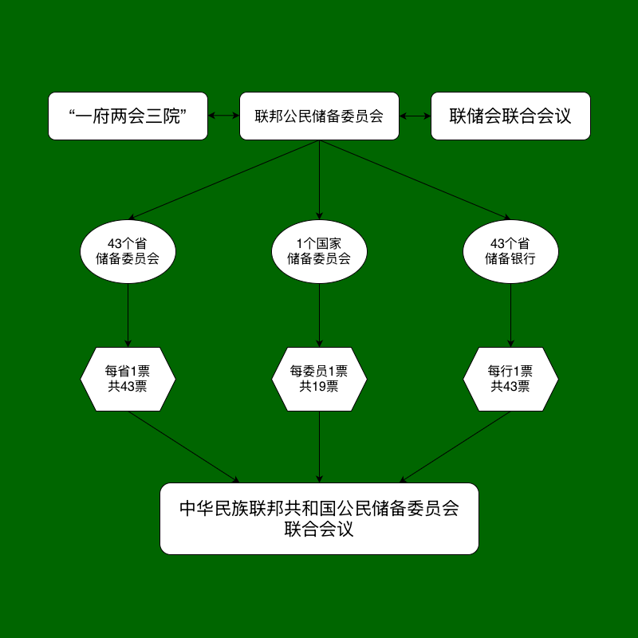

# **《公民链白皮书》**<br><span class="whitepaper-title-en">CitizenChain Whitepaper</span>

# 目录<br><span class="whitepaper-heading-en">Table of Contents</span>

- <details>
  <summary>1. 总则</summary>

  [1.1. 目的](#11目的)
  [1.2. 名称](#12名称)
  [1.2.1. 术语与命名约定](#121术语与命名约定)
  [1.3. 发行](#13发行)
  [1.4. 创世理念](#14创世理念)
  [1.5. 去中心化](#15去中心化)
  </details>

- <details>
  <summary>2. 节点设置</summary>

  [2.1. 节点概览](#21节点概览)
  [2.2. 国储会权威节点](#22国储会权威节点)
  [2.3. 省储会权威节点](#23省储会权威节点)
  [2.4. 省储行权益节点](#24省储行权益节点)
  [2.5. 全节点](#25全节点)
  [2.6. 轻节点：公民/访客](#26轻节点公民访客)
  </details>

- <details>
  <summary>3. 发行与销毁</summary>

  [3.0. 发行与销毁总览](#30发行与销毁总览)
  [3.1. 创世发行](#31创世发行)
  [3.2. 省储行创立发行与质押利息](#32省储行创立发行与质押利息)
  [3.3. 全节点发行](#33全节点发行)
  [3.4. 公民发行](#34公民发行)
  [3.5. 两和基金发行](#35两和基金发行)
  [3.6. 决议发行](#36决议发行)
  [3.7. 销毁](#37销毁)
  </details>

- <details>
  <summary>4. 技术架构</summary>

  [4.1. 主体架构](#41主体架构)
  [4.2. 节点](#42节点)
  [4.3. 运行时](#43运行时)
  </details>

- <details>
  <summary>5. 运行时</summary>

  [5.1. 创世模块](#51创世模块)
  [5.2. 投票引擎](#52投票引擎)
  [5.3. 治理模组](#53治理模组)
  [5.4. 发行模组](#54发行模组)
  [5.5. 交易模组](#55交易模组)
  [5.6. 其他模组](#56其他模组)
  </details>

- <details>
  <summary>6. 其他</summary>

  [6.1. 公民钱包](#61公民钱包)
  [6.2. 公民](#62公民)
  [6.3. 身份识别码系统](#63身份识别码系统)
  [6.4. 护照管理系统](#64护照管理系统)
  [6.5. 文库](#65文库)
  [6.6. 工具库](#66工具库)
  </details>

****
# 1.总则<br><span class="whitepaper-heading-en">1. General Principles</span>

## 1.1.目的<br><span class="whitepaper-heading-en">1.1. Purpose</span>

* 基于区块链技术以推动“公民建国运动”的主权区块链系统，创立公民链，采取去中心化民运，以建立自由民主的中华民族联邦共和国；<br><span class="whitepaper-en">CitizenChain is a sovereign blockchain system founded on blockchain technology to advance the Citizen Nation-Building Movement. It adopts a decentralized democratic movement model to establish a free and democratic Federal Republic of the China Nation.</span>
* 公民链是一条不受任何机构掌控的主权区块链，一个所有人都能自由使用的法定数字货币系统，一条所有中华民族联邦共和国公民都能参与投票的区块链；<br><span class="whitepaper-en">CitizenChain is a sovereign blockchain not controlled by any institution, a legal digital-currency system freely usable by everyone, and a blockchain on which all citizens of the Federal Republic of the China Nation may participate in voting.</span>
* 公民链依据《公民宪法》和《公民链白皮书》发行法定数字货币公民币，公民币是中华民族联邦共和国法定数字货币，是公民链治理货币；<br><span class="whitepaper-en">CitizenChain issues the legal digital currency Citizen Coin pursuant to the Citizen Constitution and the CitizenChain Whitepaper. Citizen Coin is the legal digital currency of the Federal Republic of the China Nation and the governance currency of CitizenChain.</span>

## 1.2.名称<br><span class="whitepaper-heading-en">1.2. Name</span>

* 名称：公民链（英文：CitizenChain），原生数字货币：公民币，符号：GMB；<br><span class="whitepaper-en">Name: 公民链, English name: CitizenChain. Native digital currency: Citizen Coin. Symbol: GMB.</span>
* 单位：常用单位：元（YUAN），小数单位：分（FEN），元最小为1元，分最小为1分，100分等于1元，统一使用分为系统计算单位，使用元为前端展示单位。<br><span class="whitepaper-en">Units: the common unit is yuan (YUAN), and the fractional unit is fen (FEN). The minimum yuan unit is 1 yuan, the minimum fen unit is 1 fen, and 100 fen equals 1 yuan. The system uniformly uses fen as the calculation unit and yuan as the frontend display unit.</span>

### 1.2.1.术语与命名约定<br><span class="whitepaper-heading-en">1.2.1. Terminology and Naming Conventions</span>

* 本白皮书中的中文名称、英文名称和系统名称均以本节为统一约定，全文统一使用本节名称、缩写和系统称谓。<br><span class="whitepaper-en">The Chinese names, English names, and system names in this whitepaper are uniformly defined in this section. The entire whitepaper uses the names, abbreviations, and system terms defined here.</span>

```
|         中文术语        |                 英文/系统名称                  |                         说明                         |
|:----------------------:|:---------------------------------------------:|:---------------------------------------------------:|
| 公民主义                | Citizenism                                    | 国家根本政治理念，由民治、民主、民权、民生、民族构成 |
| 公民链                  | CitizenChain                                  | 主权区块链系统                                      |
| 公民币                  | Citizen Coin / GMB                            | 公民链原生法定数字货币和治理货币                    |
| 公民钱包                | wumin / Citizen Wallet                        | 离线冷钱包软件                                      |
| 公民                    | wuminapp                                      | 公民链轻节点、热钱包、公民投票和去中心化通信软件      |
| 身份识别码系统           | SFID / Identity Identification Code System    | 在线身份识别、身份 ID、投票资格和人口快照系统         |
| 公民护照管理系统         | CPMS / Citizen Passport Management System     | 离线实名档案真源系统                                |
| 档案码                  | archive code                                  | CPMS 签发、供 SFID 生成身份 ID 的二维码载荷           |
| 清算行                  | clearing bank                                 | 完成链上注册后提供链下支付清算服务的全节点            |
| 投票资格                | voting eligibility                            | 公民是否可参与投票的资格状态，由 SFID 根据 CPMS 状态判定 |
| 投票范围                | voting scope                                  | 公民按居住地参与投票的地域范围                       |
| 参选范围                | candidacy scope                               | 公民按出生地参与被选举或出生地类选举的地域范围        |
```

## 1.3.发行<br><span class="whitepaper-heading-en">1.3. Issuance</span>

### 1.3.1.发行机构<br><span class="whitepaper-heading-en">1.3.1. Issuing Institution</span>

* 中华民族联邦共和国公民储备委员会（Citizen Reserve Committee of the Federal Republic of the China Nation），简称：中华联邦储备委员会（CRCFRCN），缩写：中联储（CRC）；<br><span class="whitepaper-en">The issuing institution is the Citizen Reserve Committee of the Federal Republic of the China Nation, abbreviated as the China Federation Reserve Committee (CRCFRCN), with the short abbreviation CRC.</span>
* 依据《公民宪法》中华民族联邦共和国公民储备委员会由1个国家储备委员会、43个省储备委员会和43个省储备银行组成。<br><span class="whitepaper-en">Pursuant to the Citizen Constitution, the Citizen Reserve Committee of the Federal Republic of the China Nation consists of one National Citizen Reserve Committee, 43 Provincial Citizen Reserve Committees, and 43 Provincial Citizen Reserve Banks.</span>

### 1.3.2.发行量<br><span class="whitepaper-heading-en">1.3.2. Issuance Amount</span>

```
|     发行类型    |               发行金额/上限           |          释放/流通状态          |               执行模块/触发                |              账户归属/边界              |
|:--------------:|:-----------------------------------:|:----------------------------:|:----------------------------------------:|:--------------------------------------:|
|  创世发行       |  144,349,737,800.00元 (1443.49亿)    |   创世一次性流通               |  创世状态写入                             |  国储会创世配置账户及开发账户              |
|  省储行创立发行  |  144,349,737,800.00元 (1443.49亿)    |   永久质押                    |  创世状态写入+省储行常量                   |  43个省储行无私钥永久质押账户              |
|  省储行质押利息  |    72,896,617,589.00元 (728.97亿)    |   100年逐年释放               |  shengbank-interest模块，每87,600块结算一次 |  43个省储行多签治理账户                   |
|  全节点发行     |    99,989,990,001.00元 (999.89亿)    |   第1至9,999,999块逐块释放      |  fullnode-issuance模块，出块时触发          |  出块矿工账户或其绑定奖励钱包              |
|  公民发行       | 1,571,981,633,622.00元 (1.57万亿)    |   SFID绑定后逐个释放            |  citizen-issuance模块，身份绑定成功回调触发   |  完成认证的公民轻节点账户                  |
|  两和基金发行    |  195,818,501,966.00元 (1958.18亿)    |   创世一次性流通               |  创世状态HE_FUND_ISSUANCE写入              |  国储会两和基金账户                       |
|  已确定发行合计  | 2,229,386,218,778.00元 (2.23万亿)    |   按上述规则释放或质押           |  固定发行合计，不含决议发行                  |  不含后续治理决议新增发行                  |
|  决议发行       |  按单个提案金额执行，受链上限额约束       |   提案通过后一次性执行           |  resolution-issuance模块+联合投票回调       |  仅能发行至链上允许的合法收款账户集合        |
```

<span class="whitepaper-en">Issuance schedule:</span>

```
|       Issuance Type        |              Amount / Cap             |              Release / Circulation Status              |                 Execution Module / Trigger                |                 Account Ownership / Boundary                |
|:--------------------------:|:------------------------------------:|:------------------------------------------------------:|:--------------------------------------------------------:|:----------------------------------------------------------:|
| Genesis issuance           | 144,349,737,800.00 yuan (144.349 billion) | One-time circulation at genesis | Written into genesis state | Genesis-configured National Citizen Reserve Committee accounts and the development account |
| Provincial reserve bank founding issuance | 144,349,737,800.00 yuan (144.349 billion) | Permanently staked | Genesis state plus provincial reserve bank constants | 43 provincial reserve bank staking accounts without private keys |
| Provincial reserve bank staking interest | 72,896,617,589.00 yuan (72.897 billion) | Released annually over 100 years | shengbank-interest module, once every 87,600 blocks | 43 provincial reserve bank multisig governance accounts |
| Full-node issuance         | 99,989,990,001.00 yuan (99.990 billion) | Released block by block from block 1 through block 9,999,999 | fullnode-issuance module, triggered by block production | Block author account or its bound reward wallet |
| Citizen light-node issuance | 1,571,981,633,622.00 yuan (1.572 trillion) | Released one by one after SFID binding | citizen-issuance module, triggered by successful identity-binding callback | Certified citizen light-node accounts |
| Reconciliation Fund issuance | 195,818,501,966.00 yuan (195.818 billion) | One-time circulation at genesis | HE_FUND_ISSUANCE written into genesis state | National Citizen Reserve Committee Reconciliation Fund account |
| Determined issuance total | 2,229,386,218,778.00 yuan (2.229 trillion) | Released or staked under the rules above | Fixed issuance total, excluding resolution issuance | Excludes later issuance added by governance resolution |
| Resolution issuance        | Executed by proposal amount and constrained by on-chain limits | One-time execution after proposal approval | resolution-issuance module plus joint-vote callback | May issue only to the on-chain allowed recipient set |
```

* 上述发行金额以元为展示单位，链上以分为计算单位；固定发行合计为2,229,386,218,778.00元，不包含后续决议发行。<br><span class="whitepaper-en">The amounts above are displayed in yuan while on-chain calculation uses fen. The fixed determined issuance total is 2,229,386,218,778.00 yuan, excluding later resolution issuance.</span>
* 决议发行不是创世固定发行的一部分，只能在联储会决议、链上联合投票和发行模块限额校验均通过后执行；交易手续费不属于发行，销毁会减少链上总供应量。<br><span class="whitepaper-en">Resolution issuance is not part of fixed genesis issuance. It may execute only after Federal Reserve Committee resolution, on-chain joint voting, and issuance-module limit checks all pass. Transaction fees are not issuance, and destruction reduces total on-chain supply.</span>

## 1.4.创世理念<br><span class="whitepaper-heading-en">1.4. Genesis Philosophy</span>

* 公民宣言：先有人类后有国家，是公民建立国家，国家是公民的国家，是公民治理国家，而不是国家统治公民，公民没有爱国的义务；国家政权的建立其基本原则是保护公民的生命权、自由权、财产权、反抗压迫权和选举与被选举权不受任何的非法侵犯，当国家政权无法保证这一基本原则时，公民有权有义务推翻这个政权，建立一个以保障公民生命权、自由权、财产权、反抗压迫权和选举与被选举权为基本原则的政权。<br><span class="whitepaper-en">Citizen Declaration: humanity precedes the state. Citizens establish the state; the state belongs to citizens; citizens govern the state; the state does not rule over citizens; and citizens have no obligation of patriotism. The founding principle of state power is to protect citizens' rights to life, liberty, property, resistance against oppression, and to vote and stand for election from any unlawful infringement. When state power cannot guarantee this basic principle, citizens have both the right and the duty to overthrow that regime and establish a regime whose founding principle is the protection of citizens' rights to life, liberty, property, resistance against oppression, and to vote and stand for election.</span>
* 国家名称与公民主义：中华民族联邦共和国国家名称是基于中华各民族悠久历史与璀璨文化的沉淀，全称为：中华民族联邦共和国，简称为：中华联邦；中华民族联邦共和国是致力于推行“公民主义”的———「公民治理国家（民治）、实现民主共和（民主）、保障公民权利（民权）、建设民生社会（民生）、复兴民族文化（民族）」———联邦制共和国。<br><span class="whitepaper-en">State name and Citizenism: the state name Federal Republic of the China Nation is rooted in the long history and splendid cultures of the various ethnic groups of the China Nation. Its full name is the Federal Republic of the China Nation, and its abbreviated name is the China Federation. The Federal Republic of the China Nation is a federal republic committed to advancing “Citizenism”: governance of the State by citizens (mínzhì), democratic republicanism (mínzhǔ), citizens’ rights (mínquán), a society of citizens’ livelihood security (mínshēng), and the revival of ethnic cultures (mínzú).</span>

## 1.5.去中心化<br><span class="whitepaper-heading-en">1.5. Decentralization</span>

* 公民链及其附属软件采用MIT开源协议，并在GitHub上开放源代码，以构建一套使开发者能快速、简易开发部署区块链应用的系统；<br><span class="whitepaper-en">CitizenChain and its affiliated software use the MIT open-source license and publish their source code on GitHub, with the goal of building a system that enables developers to develop and deploy blockchain applications quickly and easily.</span>
* 公民链坚持去中心化，任何个人、任何组织都可以加入成为去中心化的节点（全节点、轻节点），及参与公民链的治理与技术开发。<br><span class="whitepaper-en">CitizenChain upholds decentralization. Any individual or organization may join as a decentralized node, including a full node or light node, and may participate in CitizenChain governance and technical development.</span>

****
# 2.节点设置<br><span class="whitepaper-heading-en">2. Node Configuration</span>

## 2.1.节点概览<br><span class="whitepaper-heading-en">2.1. Node Overview</span>

```
|  节点  |  国储会权威节点  |   初始省储会权威节点  |  初始省储行权益节点  |     全节点     |       清算行节点       |          轻节点       |
|:-----:|:--------------:|:------------------:|:-----------------:|:-------------:|:--------------------:|:--------------------:|
|  数量  |       1个      |        43个        |        43个        |      无限     |  符合资格并完成链上注册的全节点 |      公民/访客：无限    |
|  功能  | 国家级治理与最终性 |  省级治理与最终性投票   | 永久质押与省储行治理  | PoW出块、归档、通信 | 扫码支付清算与收款方结算 | 钱包、身份绑定、投票、通信 |
```

<span class="whitepaper-en">Node overview:</span>

```
| Node | National Citizen Reserve Committee Authority Node | Initial Provincial Citizen Reserve Committee Authority Nodes | Initial Provincial Citizen Reserve Bank Stake Nodes | Full Nodes | Clearing-Bank Nodes | Light Nodes |
|:----:|:-----------------------------------------:|:----------------------------------------------------:|:------------------------------------------:|:----------:|:-------------------:|:-----------:|
| Quantity | 1 | 43 | 43 | Unlimited | Eligible full nodes that complete on-chain registration | Citizens / visitors: unlimited |
| Function | National governance and finality | Provincial governance and finality voting | Permanent staking and provincial reserve bank governance | PoW block production, archiving, communication | QR-payment clearing and recipient-bank settlement | Wallet, identity binding, voting, communication |
```



## 2.2.国储会权威节点<br><span class="whitepaper-heading-en">2.2. National Citizen Reserve Committee Authority Node</span>

* 有1个国储会权威节点，不能增删改，拥有19个管理员，分别对应国家储备委员会的19个委员；<br><span class="whitepaper-en">There is one National Citizen Reserve Committee authority node. It cannot be added, deleted, or modified. It has 19 administrators, corresponding respectively to the 19 members of the National Citizen Reserve Committee.</span>
* 国储会拥有19票投票权和4个多签名治理账户（主账户+费用账户+安全基金账户+两和基金账户），采用N=19，T≥13签名，通过则19票同时生效，反之则同时否决；<br><span class="whitepaper-en">The National Citizen Reserve Committee has 19 votes and four multisignature governance accounts: a main account, a fee account, a security fund account, and a Reconciliation Fund account. It uses N=19 and threshold T>=13 signatures. If approved, all 19 votes take effect simultaneously; otherwise, they are all rejected simultaneously.</span>
* 国储会拥有发起“发行数字公民币、销毁数字公民币、协议升级、更换国储会多签管理员、增删改新省储会/新省储行”等提案权，承担数据归档和节点引导；<br><span class="whitepaper-en">The National Citizen Reserve Committee has the authority to initiate proposals including issuing digital Citizen Coins, destroying digital Citizen Coins, protocol upgrades, replacing National Citizen Reserve Committee multisig administrators, and adding, deleting, or modifying new Provincial Citizen Reserve Committees or Provincial Citizen Reserve Banks. It also undertakes data archiving and node bootstrapping.</span>
* 国储会和省储会负责区块的最终性确认，由一套最终性验证密钥负责投票，此投票仅属于区块的最终性确认投票，投票由国储会1票+43个省储会每省1票=44票，大于等于30票即生成确定性最终性；<br><span class="whitepaper-en">The National Citizen Reserve Committee and Provincial Citizen Reserve Committees are responsible for block finality confirmation. A set of finality validation keys is responsible for voting, and this vote is only for block finality confirmation. The vote consists of one National Citizen Reserve Committee vote plus one vote from each of the 43 Provincial Citizen Reserve Committees, for a total of 44 votes. At least 30 votes generate deterministic finality.</span>
* 国储会费用账户用于接收10%的链上交易手续费，且只能往主账户转账；安全基金账户用于接收10%的链上交易手续费，安全基金用于赔付用户因区块链技术原因造成的损失。<br><span class="whitepaper-en">The National Citizen Reserve Committee fee account receives 10% of on-chain transaction fees and may only transfer funds to the main account. The security fund account receives 10% of on-chain transaction fees, and the security fund is used to compensate users for losses caused by blockchain technology reasons.</span>

## 2.3.省储会权威节点<br><span class="whitepaper-heading-en">2.3. Provincial Citizen Reserve Committee Authority Nodes</span>

* 初始43个省，每省1个省储会权威节点，初始权威节点不能增删改，每个节点拥有9个管理员，分别对应省储备委员会的9个委员；<br><span class="whitepaper-en">There are initially 43 provinces, each with one Provincial Citizen Reserve Committee authority node. These initial authority nodes cannot be added, deleted, or modified. Each node has nine administrators, corresponding respectively to the nine members of the Provincial Citizen Reserve Committee.</span>
* 每个省储会拥有1票投票权和2个多签名治理账户（主账户+费用账户），采用N=9，T≥6签名，签名通过则生效，反之则否决；<br><span class="whitepaper-en">Each Provincial Citizen Reserve Committee has one vote and two multisignature governance accounts: a main account and a fee account. It uses N=9 and threshold T>=6 signatures. If the signatures pass, the decision takes effect; otherwise, it is rejected.</span>
* 省储会拥有发起“销毁数字公民币、更换省储会多签管理员、提案发行”等提案权，承担数据归档、节点引导和区块最终性投票。<br><span class="whitepaper-en">A Provincial Citizen Reserve Committee has the authority to initiate proposals including destroying digital Citizen Coins, replacing Provincial Citizen Reserve Committee multisig administrators, and proposing issuance. It undertakes data archiving, node bootstrapping, and block finality voting.</span>

## 2.4.省储行权益节点<br><span class="whitepaper-heading-en">2.4. Provincial Citizen Reserve Bank Stake Nodes</span>

* 初始43个省，每省1个省储行权益节点，初始权益节点不能增删改，每个节点拥有9个管理员，分别对应省储行的9个董事会成员；<br><span class="whitepaper-en">There are initially 43 provinces, each with one Provincial Citizen Reserve Bank stake node. These initial stake nodes cannot be added, deleted, or modified. Each node has nine administrators, corresponding respectively to the nine board members of the Provincial Citizen Reserve Bank.</span>
* 每个省储行拥有1票投票权和2个多签名治理账户（主账户+费用账户），采用N=9，T≥6签名，签名通过则生效，反之则否决；<br><span class="whitepaper-en">Each Provincial Citizen Reserve Bank has one vote and two multisignature governance accounts: a main account and a fee account. It uses N=9 and threshold T>=6 signatures. If the signatures pass, the decision takes effect; otherwise, it is rejected.</span>
* 省储行费用账户是省储行自身的机构费用账户；链下清算由完成链上注册的清算行全节点承担；<br><span class="whitepaper-en">The Provincial Citizen Reserve Bank fee account is the Provincial Citizen Reserve Bank's own institutional fee account. Off-chain clearing is undertaken by full nodes that complete on-chain clearing-bank registration.</span>
* 每个省储行拥有1个永久质押账户，永久质押账户只能接收数字公民币，用于永久质押省储行创立发行的数字公民币；<br><span class="whitepaper-en">Each Provincial Citizen Reserve Bank has one permanent staking account. The staking account may only receive digital Citizen Coins and is used to permanently stake the digital Citizen Coins issued at the founding of the Provincial Citizen Reserve Bank.</span>
* 省储行拥有发起“销毁数字公民币、更换省储行多签管理员”等内部治理提案权，并在联合投票中拥有省储行票权，承担数据归档和节点引导。<br><span class="whitepaper-en">A Provincial Citizen Reserve Bank has the authority to initiate internal-governance proposals including destroying digital Citizen Coins and replacing Provincial Citizen Reserve Bank multisig administrators. It also holds Provincial Citizen Reserve Bank voting power in joint votes and undertakes data archiving and node bootstrapping.</span>

## 2.5.全节点<br><span class="whitepaper-heading-en">2.5. Full Nodes</span>

* 全节点是数据归档和新块铸块节点，负责数据归档、去中心化通信和所有新区块的铸造，新区块特指除创世区块以外的所有区块，采用PoW共识机制获得铸块权；<br><span class="whitepaper-en">Full nodes are data-archiving and new-block minting nodes. They are responsible for data archiving, decentralized communication, and the minting of all new blocks. New blocks refer to all blocks other than the genesis block. Full nodes obtain block-minting rights through the PoW consensus mechanism.</span>
* 全节点数量不限，部署运行citizenchain（中文：公民链）的即全节点，任何组织、任何人均可下载安装节点软件成为全节点，全节点分为归档全节点、普通全节点和通信全节点这3种模式，默认启动为归档全节点模式；<br><span class="whitepaper-en">The number of full nodes is unlimited. Any deployment that runs citizenchain (Chinese: 公民链) is a full node. Any organization or individual may download and install the node software to become a full node. Full nodes are divided into three modes: archive full nodes, regular full nodes, and communication full nodes. The default startup mode is archive full node.</span>
* 清算行不是新的机构类型，而是全节点的链下清算角色；全节点在 SFID 系统注册为私法人股份公司或其下属非法人，并在链上完成清算行节点声明后，可加入清算网络成为清算行节点；<br><span class="whitepaper-en">A clearing bank is not a new institution type; it is an off-chain clearing role of a full node. A full node registered in the SFID system as a private legal-person joint-stock company or its subordinate unincorporated entity may join the clearing network as a clearing-bank node after completing on-chain clearing-bank node declaration.</span>
* 清算行节点必须绑定机构主账户、节点 PeerId 和可访问的 RPC 端点；用户可绑定清算行开户，清算行可提供扫码支付清算服务，并获得其作为收款方清算行实际执行的链下清算手续费；<br><span class="whitepaper-en">A clearing-bank node must bind its institutional main account, node PeerId, and reachable RPC endpoint. Users may bind a clearing bank to open a clearing account. The clearing bank may provide QR-payment clearing services and receives the off-chain clearing fees for settlement it actually performs as the recipient-side clearing bank.</span>
* 清算网络是连接去中心化金融与传统金融的纽带，把符合资格并有能力部署全节点的银行、第三方支付机构和企业纳入公民链，为用户提供快速的去中心化金融服务。<br><span class="whitepaper-en">The clearing network links decentralized finance with traditional finance. It brings eligible banks, third-party payment providers, and enterprises capable of deploying full nodes into CitizenChain, providing users with fast decentralized financial services.</span>
* 权威节点、权益节点和清算行节点必须是归档全节点，其他任意节点可自行选择节点模式，归档全节点保存完整的区块链数据；普通全节点适用于大部分用户，不用保存完整的区块链数据，使用剪裁后的链数据，同时保留了挖矿、出块的能力，以节约用户的磁盘空间；通信全节点适用于不参与网络共识，不参与挖矿，只需要使用去中心化通信的用户，使用通信全节点模式的用户，可以把安装在电脑上的区块链软件作为wuminapp的p2p通信中继，以实现完全去中心化的即时通信。<br><span class="whitepaper-en">Authority nodes, stake nodes, and clearing-bank nodes must be archive full nodes. Any other node may choose its node mode independently. Archive full nodes store complete blockchain data. Regular full nodes are suitable for most users: they do not need to store complete blockchain data, use pruned chain data, and still retain mining and block-production capability, thereby saving disk space. Communication full nodes are suitable for users who do not participate in network consensus or mining and only need decentralized communication. Users in communication full-node mode may use the blockchain software installed on their computers as a WuminApp P2P communication relay to enable fully decentralized instant messaging.</span>

## 2.6.轻节点：公民/访客<br><span class="whitepaper-heading-en">2.6. Light Nodes: Citizens / Visitors</span>

* 使用WuminApp（公民）节点软件，使用身份识别码（SFID）绑定的即公民轻节点，SFID和公民轻节点任意公钥地址一对一绑定，完成绑定后可获得投票权，一个SFID只能同时与一个公钥地址绑定。<br><span class="whitepaper-en">A light node using the WuminApp citizen node software and bound with an identity identification code (SFID) is a citizen light node. An SFID is bound one-to-one with any public-key address of the citizen light node. After binding is completed, the node obtains voting rights. One SFID may be bound to only one public-key address at a time.</span>
* 安装WuminApp节点软件未绑定的,为访客轻节点，访客轻节点没有投票权，使用第三方钱包的，亦为访客轻节点。<br><span class="whitepaper-en">A WuminApp node installation that is not bound is a visitor light node. Visitor light nodes have no voting rights. Users of third-party wallets are also visitor light nodes.</span>

****
# 3.发行与销毁<br><span class="whitepaper-heading-en">3. Issuance and Destruction</span>

## 3.0.发行与销毁总览<br><span class="whitepaper-heading-en">3.0. Issuance and Destruction Overview</span>

* 公民币发行分为固定发行和决议发行：固定发行由创世状态、固定常量和身份绑定规则确定；决议发行由联储会决议、链上联合投票和发行模块校验共同约束；<br><span class="whitepaper-en">Citizen Coin issuance is divided into fixed issuance and resolution issuance. Fixed issuance is determined by genesis state, fixed constants, and identity-binding rules. Resolution issuance is constrained jointly by Federal Reserve Committee resolution, on-chain joint voting, and issuance-module validation.</span>
* 固定发行合计为2,229,386,218,778.00元，其中一部分在创世时流通，一部分永久质押，一部分按区块、年度或身份绑定逐步释放；<br><span class="whitepaper-en">The fixed issuance total is 2,229,386,218,778.00 yuan. Part of it circulates at genesis, part is permanently staked, and part is released progressively by block height, annual settlement, or identity binding.</span>
* 交易手续费不是新增发行；链上交易手续费按规则分配给全节点、国储会费用账户和安全基金，链下清算手续费由清算网络规则处理；<br><span class="whitepaper-en">Transaction fees are not new issuance. On-chain transaction fees are distributed under the rules to full nodes, the National Citizen Reserve Committee fee account, and the safety fund; off-chain clearing fees are handled under the clearing-network rules.</span>
* 销毁由对应机构内部投票通过后执行，销毁结果直接减少账户余额和链上总供应量；低于 Existential Deposit (ED) 的账户清理属于账户生命周期规则。<br><span class="whitepaper-en">Destruction executes after approval by the corresponding institution's internal vote, directly reducing the account balance and total on-chain supply. Reaping accounts below the Existential Deposit (ED) belongs to the account lifecycle rule.</span>

## 3.1.创世发行<br><span class="whitepaper-heading-en">3.1. Genesis Issuance</span>

* 创世发行144,349,737,800.00元数字公民币（1443.49亿元），以中共第7次人口普查数为准，每个中共国人发行100.00元数字公民币，创世状态时国储会即向开发账户支付10000000.00元公民币；<br><span class="whitepaper-en">Genesis issuance is 144,349,737,800.00 yuan of digital Citizen Coins (144.349 billion yuan), based on the CCP's Seventh National Population Census. Each person under CCP rule is issued 100.00 yuan of digital Citizen Coins. At genesis state, the National Citizen Reserve Committee pays 10,000,000.00 Citizen Coins to the development account.</span>

```
中共第7次人口普查总人口数：1,443,497,378人   ｜    公民币创世发行量：144,349,737,800.00元
```

<span class="whitepaper-en">CCP's Seventh National Population Census total population: 1,443,497,378 people | Citizen Coin genesis issuance: 144,349,737,800.00 yuan</span>

* 国储会多签治理账户（公民链）,国储会在公民链上唯一的治理账户，由国储会身份识别码：GFR-LN001-CB0X-944805165-2026派生:<br><span class="whitepaper-en">The National Citizen Reserve Committee multisig governance account on CitizenChain is the National Citizen Reserve Committee's only governance account on CitizenChain. It is derived from the National Citizen Reserve Committee identity identification code: GFR-LN001-CB0X-944805165-2026.</span>

```
w5FxV4G57ZQGZCWbVYLAjKYHtwaDGEbf1AGsMgfmr5KXe1KS8
```

* 一个人在社会中享有若干权益的同时，同样应尽若干义务，尽了若干义务的，亦应享受若干权益；创世发行寓意每一个中共国人支付100.00元公民币，以支持“公民建国运动”，使全体中共国人共同建立中华民族联邦共和国。<br><span class="whitepaper-en">While a person enjoys certain rights and interests in society, that person should likewise fulfill certain obligations; and after fulfilling certain obligations, that person should likewise enjoy certain rights and interests. Genesis issuance symbolizes each person under CCP rule paying 100.00 Citizen Coins to support the Citizen Nation-Building Movement, so that all people under CCP rule jointly establish the Federal Republic of the China Nation.</span>
* 创世发行只在创世状态中写入一次，链进入运行期后不得再次触发创世发行；开发账户支付属于创世状态分配，不是后续可重复调用的发行入口。<br><span class="whitepaper-en">Genesis issuance is written exactly once in genesis state. After the chain enters the operating period, genesis issuance cannot be triggered again. The development-account payment is part of genesis-state allocation and is not a later repeatable issuance entry point.</span>

## 3.2.省储行创立发行与质押利息<br><span class="whitepaper-heading-en">3.2. Provincial Citizen Reserve Bank Founding Issuance and Staking Interest</span>

* 初始省储行节点，每个省储行发行该省总人口数x100的数字公民币，各省人口以中共第7次人口普查数为准（并做省份调整），共计发行144,349,737,800元；<br><span class="whitepaper-en">For the initial Provincial Citizen Reserve Bank nodes, each Provincial Citizen Reserve Bank issues digital Citizen Coins equal to that province's total population multiplied by 100. Provincial populations are based on the CCP's Seventh National Population Census, with provincial adjustments, for a total issuance of 144,349,737,800 yuan.</span>
* 各省储行创立发行的数字公民币永久质押于该省储行质押地址，该地址为无私钥地址，永久质押；<br><span class="whitepaper-en">The digital Citizen Coins issued at the founding of each Provincial Citizen Reserve Bank are permanently staked at that Provincial Citizen Reserve Bank's staking address. This address has no private key and is permanently staked.</span>
* 各省储行质押的数字公民币，由区块链支付100年质押利息,质押利息存入各省储行多签名治理账户，利息归各省储行所有，用于省储行运营和资助公民运动人士；<br><span class="whitepaper-en">For the digital Citizen Coins staked by each Provincial Citizen Reserve Bank, the blockchain pays staking interest for 100 years. The staking interest is deposited into each Provincial Citizen Reserve Bank multisignature governance account, belongs to that Provincial Citizen Reserve Bank, and is used for Provincial Citizen Reserve Bank operations and to support citizen-movement activists.</span>
* 质押利息初始年利率为1%，并以线性衰减的方式每年减少0.01%，100年后停止计算利息，共产生利息72,896,617,589.00元公民币；<br><span class="whitepaper-en">The initial annual staking-interest rate is 1%, decreasing linearly by 0.01% each year. Interest calculation stops after 100 years, producing total interest of 72,896,617,589.00 Citizen Coins.</span>
* 省储行质押利息由 shengbank-interest 模块按年度边界结算，每年为87,600个区块；收款方固定为43个省储行多签治理账户，不能由外部调用临时替换；<br><span class="whitepaper-en">Provincial reserve bank staking interest is settled by the shengbank-interest module at annual boundaries, with one year equal to 87,600 blocks. Recipients are fixed as the 43 provincial reserve bank multisig governance accounts and cannot be temporarily replaced by an external call.</span>
* 年度利息按顺序结算，前一年度未完成时不得跳过后续年度；当年度43个省储行均结算成功后，该年度才视为完成，低于 ED 的粉尘利息不铸造。<br><span class="whitepaper-en">Annual interest is settled sequentially. Later years cannot be skipped while an earlier year remains unsettled. A year is considered complete only after all 43 provincial reserve banks settle successfully, and dust interest below ED is not minted.</span>
* 各省储行创立发行与质押利息详见：citizenchain/runtime/primitives/china/china_ch.rs<br><span class="whitepaper-en">For details of each Provincial Citizen Reserve Bank founding issuance and staking interest, see citizenchain/runtime/primitives/china/china_ch.rs.</span>

## 3.3.全节点发行<br><span class="whitepaper-heading-en">3.3. Full-Node Issuance</span>

* 运行全节点的每铸造一个新区块，系统发行9999.00元数字公民币用于奖励该节点，全节点铸块发行为第1个至第9,999,999个区块，共计发行量为99,989,990,001.00元数字公民币；<br><span class="whitepaper-en">Each time a running full node mints a new block, the system issues 9,999.00 yuan of digital Citizen Coins to reward that node. Full-node block-minting issuance applies from block 1 through block 9,999,999, with a total issuance of 99,989,990,001.00 digital Citizen Coins.</span>
* 当区块高度超过9,999,999个区块后（第10,000,000个起，含本数），即永久停止全节点发行，此后全节点铸造新块不获得铸块奖励（运行全节点享受链上交易手续费80%的分成）。<br><span class="whitepaper-en">When block height exceeds 9,999,999 blocks, starting from block 10,000,000 inclusive, full-node issuance permanently stops. Full nodes that mint new blocks thereafter receive no block rewards, though running full nodes receive an 80% share of on-chain transaction fees.</span>
* 全节点发行只负责按出块事实发放奖励，不参与 PoW 出块权计算；奖励在区块完成时根据区块作者写入矿工账户，矿工绑定奖励钱包后写入其绑定钱包。<br><span class="whitepaper-en">Full-node issuance only pays rewards according to actual block production and does not participate in PoW block-author selection. Rewards are written to the miner account when the block completes, or to the miner's bound reward wallet after such binding exists.</span>

```
|  单个区块发行量 |   可发行的区块总量   |        总发行量          |     简述     |
|:-------------:|:-----------------:|:-----------------------:|:-----------:|
|   9999.00元   |     9,999,999个    |  99,989,990,001.00元   |  999.89亿元   |
```

<span class="whitepaper-en">Full-node issuance table:</span>

```
| Issuance Per Block | Total Issuable Blocks | Total Issuance | Summary |
|:------------------:|:---------------------:|:--------------:|:-------:|
| 9,999.00 yuan | 9,999,999 blocks | 99,989,990,001.00 yuan | 99.989 billion yuan |
```

## 3.4.公民发行<br><span class="whitepaper-heading-en">3.4. Citizen Issuance</span>

* 使用身份识别码（SFID）完成公民轻节点认证的，将获得认证奖励，可获得认证奖励的节点总量为1,443,497,378个，前14,436,417个认证的公民轻节点，每个认证的节点奖励9999.00元；第14,436,417个之后再认证的公民轻节点，每个认证的节点奖励999.00元；<br><span class="whitepaper-en">A citizen light node that completes certification with an identity identification code (SFID) receives a certification reward. The total number of nodes eligible for certification rewards is 1,443,497,378. Each of the first 14,436,417 certified citizen light nodes receives a reward of 9,999.00 yuan; each citizen light node certified after the 14,436,417th receives a reward of 999.00 yuan.</span>
* 达到公民发行总量后，后续认证的节点无奖励，认证发行奖励以先完成认证优先获得，每个身份识别码仅能获得一次认证奖励，公民发行能让更多的公民参与“公民建国运动”。<br><span class="whitepaper-en">After the citizen issuance cap is reached, later certified nodes receive no rewards. Certification issuance rewards are obtained in priority order by those who complete certification first. Each identity identification code may receive the certification reward only once. Citizen issuance enables more citizens to participate in the Citizen Nation-Building Movement.</span>
* 公民发行不提供人工补发入口，也不由用户直接调用发行接口；只有 SFID 绑定公民轻节点成功后，链上身份绑定回调才能触发 citizen-issuance 模块执行奖励。<br><span class="whitepaper-en">Citizen issuance provides no manual reissue entry point and is not directly invoked by users. Only after SFID successfully binds a citizen light node may the on-chain identity-binding callback trigger the citizen-issuance module to execute the reward.</span>
* 同一身份识别码、同一账户均只能获得一次公民发行奖励；达到节点总量上限或重复绑定时，模块只记录跳过结果，不新增发行。<br><span class="whitepaper-en">The same identity identification code and the same account may each receive the citizen issuance reward only once. When the node cap is reached or a repeated binding occurs, the module only records the skipped result and does not create new issuance.</span>

```
|   阶段    |     认证节点数     |   单节点发行金额   |         总发行量          |      简述       |
|:--------:|:-----------------:|:---------------:|:------------------------:|:--------------:|
|  未超过   |     14,436,417个  |    9,999.00元    |    144,349,733,583.00元  |   1443.49亿元   |
|  超过后   |  1,429,060,961个  |      999.00元    |  1,427,631,900,039.00元  |  14276.31亿元   |
|  总 计    |  1,443,497,378个  |        -        |  1,571,981,633,622.00元  |  15719.81亿元   |
```

<span class="whitepaper-en">Citizen issuance table:</span>

```
| Stage | Certified Nodes | Issuance Per Node | Total Issuance | Summary |
|:-----:|:---------------:|:-----------------:|:--------------:|:-------:|
| Up to the threshold | 14,436,417 | 9,999.00 yuan | 144,349,733,583.00 yuan | 144.349 billion yuan |
| After the threshold | 1,429,060,961 | 999.00 yuan | 1,427,631,900,039.00 yuan | 1.427631 trillion yuan |
| Total | 1,443,497,378 | - | 1,571,981,633,622.00 yuan | 1.571981 trillion yuan |
```

## 3.5.两和基金发行<br><span class="whitepaper-heading-en">3.5. Reconciliation Fund Issuance</span>

* 两和基金发行是指历史和解与和平建国基金发行，发行目的是为了历史和解与和平建立民主自由的中华民族联邦共和国；中华民族的历史包袱太重，几千年的同室操戈、相互攻伐致使历史血债累累，但是，如果我们不从历史中汲取教训，继续争斗，即使再过数千年，这片土地上也不会长出自由、博爱的花朵；所以，需要从我们这一代人开始，与历史和解，把所有的仇恨化为明鉴，放下仇恨，以和平的方式建立一个自由、民主、博爱的国家；<br><span class="whitepaper-en">Reconciliation Fund issuance refers to the issuance of the Historical Reconciliation and Peaceful Nation-Building Fund. Its purpose is to achieve historical reconciliation and peace and to build a democratic and free Federal Republic of the China Nation. The China nation carries too heavy a historical burden: thousands of years of internecine strife and mutual slaughter have left a long trail of blood debts. Yet if we do not learn from history and keep fighting, then even after thousands more years no flowers of freedom and fraternity will grow on this land. Therefore, beginning with our generation, we must reconcile with history, turn all hatred into a clear mirror, lay down our hatred, and build a free, democratic, and fraternal nation by peaceful means.</span>
* 两和基金发行额为195,818,501,966.00元（1958.18亿元），其中，1958代表大跃进、1850代表太平天国战争、1966代表文革运动，整组数据分别表达中华大地上死亡人数最多的政治运动、死亡人数最多的战争和人文倒退最严重的文化大革命运动，以此警醒世人勿重蹈覆辙；<br><span class="whitepaper-en">The Reconciliation Fund issuance amount is 195,818,501,966.00 yuan (195.818 billion yuan). In this figure, 1958 stands for the Great Leap Forward, 1850 for the Taiping Rebellion war, and 1966 for the Cultural Revolution — respectively the political movement with the highest death toll, the war with the highest death toll, and the Cultural Revolution that caused the most severe humanistic regression on the Chinese land — as a warning to the world never to repeat these tragedies.</span>
* 两和基金仅用于赔偿因各类战争、运动或人祸中非正常死亡的同胞的后代，以及建设相关纪念警示场馆，由国储会两和基金账户持有，国储会使用内部投票管理基金；<br><span class="whitepaper-en">The Reconciliation Fund is used solely to compensate the descendants of compatriots who died abnormally in wars, political movements, or man-made disasters of all kinds, and to build related memorial and cautionary facilities. It is held by the National Citizen Reserve Committee's Reconciliation Fund account, and the National Citizen Reserve Committee manages the fund through internal votes.</span>
* 两和基金在创世状态中一次性写入国储会两和基金账户，计入链上总供应量，但独立于创世发行、公民发行和决议发行，不提供运行期重复发行入口。<br><span class="whitepaper-en">The Reconciliation Fund is written once into the National Citizen Reserve Committee Reconciliation Fund account at genesis and counts toward total on-chain supply. It is independent from genesis issuance, citizen issuance, and resolution issuance, and provides no repeatable operating-period issuance entry point.</span>

## 3.6.决议发行<br><span class="whitepaper-heading-en">3.6. Resolution Issuance</span>

* 成立“联邦公民储备委员会”后，由联储会联合会议决议发行数字公民币，经联储会联合会议决议通过后，由国储会或任意省储会权威节点提案发起决议发行，使用“联合投票”流程执行；联合投票全票通过的直接执行，非全票或超期的进入联合投票模块内的联合公投阶段，由联合公投结果决定是否执行；<br><span class="whitepaper-en">After the Federal Citizen Reserve Committee is established, digital Citizen Coins are issued by resolution of the Federal Reserve Committee joint meeting. After that resolution is passed by the Federal Reserve Committee joint meeting, the National Citizen Reserve Committee authority node or any Provincial Citizen Reserve Committee authority node may initiate a proposal to start resolution issuance, which is executed through the joint-vote process. If the joint vote is unanimous, execution occurs directly; if it is non-unanimous or times out, the proposal enters the joint referendum stage inside the joint-vote module, and execution depends on the joint referendum result.</span>
* 决议发行子模块统一负责提案创建、联合投票结果接收、发行执行、执行幂等和暂停维护；发行只能由投票引擎回调触发，不能通过人工终结或绕过投票流程直接铸造；<br><span class="whitepaper-en">The resolution issuance submodule is uniformly responsible for proposal creation, receiving joint-vote results, issuance execution, execution idempotency, and pause-based maintenance. Issuance may be triggered only by a voting-engine callback and cannot be minted directly through manual finalization or by bypassing the voting process.</span>
* 决议发行必须通过收款账户集合、金额合计、单次限额、累计限额、ED、暂停状态和防重放校验；提案收款账户必须与链上允许收款账户集合一致，不得在提案内临时指定任意私账。<br><span class="whitepaper-en">Resolution issuance must pass checks for recipient set, total allocation amount, single-issuance cap, cumulative cap, ED, pause state, and anti-replay. Proposal recipients must match the on-chain allowed recipient set and may not temporarily designate arbitrary private accounts inside the proposal.</span>
* 适时发行纸质公民币，纸质公民币用以替换人民币，数字公民币与纸质公民币按1:1兑换，公民币与人民币及其他货币自由兑换；<br><span class="whitepaper-en">Paper Citizen Coins will be issued at the proper time to replace the renminbi. Digital Citizen Coins and paper Citizen Coins are exchanged at a 1:1 ratio, and Citizen Coins are freely exchangeable with renminbi and other currencies.</span>
* 纸质公民币面额由1元、5元、10元、20元、50元、100元和500元共7种面额组成；另由国家铸币局统一铸造硬币，硬币面额由1分、5分、10分、20分和50分共5种面额组成。<br><span class="whitepaper-en">Paper Citizen Coin denominations consist of seven denominations: 1 yuan, 5 yuan, 10 yuan, 20 yuan, 50 yuan, 100 yuan, and 500 yuan. Coins are uniformly minted by the National Mint, with five denominations: 1 fen, 5 fen, 10 fen, 20 fen, and 50 fen.</span>

## 3.7.销毁<br><span class="whitepaper-heading-en">3.7. Destruction</span>

* 国储会权威节点可发起销毁所持有账户内的公民币，国储会发起销毁流程的，在国储会“内部投票”；<br><span class="whitepaper-en">The National Citizen Reserve Committee authority node may initiate destruction of Citizen Coins held in accounts it controls. When the National Citizen Reserve Committee initiates a destruction process, it is decided by an internal vote of the National Citizen Reserve Committee.</span>
* 省储会权威节点可发起销毁所持有账户内的公民币，省储会发起销毁流程的，在该省储会“内部投票”；<br><span class="whitepaper-en">A Provincial Citizen Reserve Committee authority node may initiate destruction of Citizen Coins held in accounts it controls. When a Provincial Citizen Reserve Committee initiates a destruction process, it is decided by an internal vote of that Provincial Citizen Reserve Committee.</span>
* 省储行权益节点可发起销毁所持有账户内的公民币，省储行发起销毁流程的，在该省储行“内部投票”；<br><span class="whitepaper-en">A Provincial Citizen Reserve Bank stake node may initiate destruction of Citizen Coins held in accounts it controls. When a Provincial Citizen Reserve Bank initiates a destruction process, it is decided by an internal vote of that Provincial Citizen Reserve Bank.</span>
* 决议销毁只能销毁提案主体自身控制账户中的公民币，不能替其他主体销毁；销毁执行时必须保留 ED，不能把账户销毁到违反账户生命周期规则的状态；<br><span class="whitepaper-en">Resolution destruction may destroy only Citizen Coins in accounts controlled by the proposing subject itself and may not destroy funds for another subject. Execution must preserve ED and may not destroy an account into a state that violates account lifecycle rules.</span>
* 销毁通过链上余额扣减执行，销毁金额从总供应量中扣除；已通过但执行失败的销毁提案保留可重试状态，由投票引擎的已通过提案重试流程继续执行。<br><span class="whitepaper-en">Destruction is executed by reducing the on-chain balance, and the destroyed amount is deducted from total supply. A destruction proposal that has passed but failed during execution keeps a retryable passed state and continues through the voting engine's retry flow for passed proposals.</span>
* 链上账户余额低于1.11元的账户将被清理账户Existential Deposit (ED)，账户中的余额将被销毁。<br><span class="whitepaper-en">On-chain accounts with balances below 1.11 yuan will be reaped under the Existential Deposit (ED) rule, and the remaining balance in the account will be destroyed.</span>

****
# 4.技术架构<br><span class="whitepaper-heading-en">4. Technical Architecture</span>

* 感谢 Polkadot 团队的奉献！<br><span class="whitepaper-en">Thanks to the Polkadot team for its contributions.</span>

## 4.1.主体架构<br><span class="whitepaper-heading-en">4.1. Core Architecture</span>

* 主体使用Rust语言，采用Substrate框架开发，节点软件使用Tauri框架，手机端使用flutter开发；<br><span class="whitepaper-en">The core system is written in Rust and developed with the Substrate framework. The node software uses the Tauri framework, and the mobile client is developed with Flutter.</span>
* 采用模块化开发，开发初期就要做好为后期去框架的准备，并符合长期技术演进，为今后重构中国的政府、金融、通信等领域的应用预留扩展。<br><span class="whitepaper-en">The system uses modular development. From the early development stage, it must prepare for later framework removal and align with long-term technical evolution, leaving room for future reconstruction of applications in China's government, finance, communications, and other fields.</span>
* 主体架构图<br><span class="whitepaper-en">Core architecture diagram:</span>

```
GMB/
├── citizenchain/            # 公民链
│   ├── node/                # 区块链节点程序（chain_spec、service、cli等）
│   └── runtime/             # Runtime（链的统一运行时状态）
│         ├── genesis/         # 创世模块（负责区分创世期/运行期）
│         ├── votingengine/    # 投票引擎（内部投票、联合投票、公民投票模块）
│         ├── governance/      # 治理模组（由多个治理子模块组成）
│         ├── issuance/        # 发行模组（由多个发行子模块组成）
│         ├── transaction/     # 交易模组（由多个交易子模块组成）
│         ├── otherpallet/     # 其他模组（由多个其他子模块组成）
│         └── primitives/      # 常量库
│
├── wumin/                   # 冷钱包软件（公民钱包，iOS、Android）
├── wuminapp/                # 轻节点软件（热钱包、公民投票、隐私通信、资产管理，iOS、Android）
├── sfid/                    # 身份识别码系统（链外系统）
├── cpms/                    # 公民护照管理系统（链外系统）
├── docs/                    # 文库（文档、图片、参考资料等）
└── tools/                   # 工具库（账户生成、Key工具等）
```

<span class="whitepaper-en">English architecture map:</span>

```
GMB/
├── citizenchain/            # CitizenChain
│   ├── node/                # Blockchain node program, including chain_spec, service, cli, and related code
│   └── runtime/             # Runtime, the unified on-chain runtime state
│         ├── genesis/         # Genesis module, responsible for distinguishing genesis period and operating period
│         ├── votingengine/    # Voting engine, including internal vote, joint vote, and citizen vote modules
│         ├── governance/      # Governance module group, composed of multiple governance submodules
│         ├── issuance/        # Issuance module group, composed of multiple issuance submodules
│         ├── transaction/     # Transaction module group, composed of multiple transaction submodules
│         ├── otherpallet/     # Other module group, composed of multiple other submodules
│         └── primitives/      # Constants library
│
├── wumin/                   # Cold-wallet software, Citizen Wallet for iOS and Android
├── wuminapp/                # Light-node software: hot wallet, citizen voting, private communication, and asset management for iOS and Android
├── sfid/                    # Identity identification code system, off-chain
├── cpms/                    # Citizen passport management system, off-chain
├── docs/                    # Document library: documents, images, and reference materials
└── tools/                   # Tool library: account generation, key tools, and related tools
```

****
## 4.2.节点<br><span class="whitepaper-heading-en">4.2. Node</span>

### 4.2.1.网络模块<br><span class="whitepaper-heading-en">4.2.1. Network Module</span>

* 网络类型：libp2p<br><span class="whitepaper-en">Network type: libp2p.</span>
* 网络密钥：Ed25519<br><span class="whitepaper-en">Network key: Ed25519.</span>

### 4.2.2.安全模块<br><span class="whitepaper-heading-en">4.2.2. Security Module</span>

* 使用Blake2哈希算法<br><span class="whitepaper-en">Uses the Blake2 hash algorithm.</span>
* 使用sr25519加密算法<br><span class="whitepaper-en">Uses the sr25519 cryptographic algorithm.</span>

### 4.2.3.存储模块<br><span class="whitepaper-heading-en">4.2.3. Storage Module</span>

* RocksDB+本机储存<br><span class="whitepaper-en">RocksDB plus local storage.</span>

### 4.2.4.工作量证明<br><span class="whitepaper-heading-en">4.2.4. Proof of Work / PoW</span>

* 全节点使用PoW工作量证明共识获得铸块权，负责链上交易验证并铸块；<br><span class="whitepaper-en">Full nodes obtain block-minting rights through Proof of Work (PoW) consensus and are responsible for on-chain transaction validation and block minting.</span>
* 权威节点使用GRANDPA确定性最终性验证，由44个权威节点（国储会1个+省储会43个）验证。<br><span class="whitepaper-en">Authority nodes use GRANDPA deterministic finality validation, validated by 44 authority nodes: one National Citizen Reserve Committee node plus 43 Provincial Citizen Reserve Committee nodes.</span>

## 4.3.运行时<br><span class="whitepaper-heading-en">4.3. Runtime</span>

* 链的统一运行时逻辑，联合投票通过可进行协议升级，详见5.3.1.协议升级。<br><span class="whitepaper-en">The runtime is the chain's unified runtime logic. A protocol upgrade may be performed after passage through joint voting. See section 5.3.1, Protocol Upgrade.</span>

****
# 5.运行时<br><span class="whitepaper-heading-en">5. runtime</span>

## 5.1.创世模块<br><span class="whitepaper-heading-en">5.1. genesis</span>

* 创世模块定义区块链的创世期和运行期；<br><span class="whitepaper-en">The genesis module defines the blockchain's genesis period and operating period.</span>
* 创世期为区块链开发阶段，快速更新迭代、快速出块，开发者直接升级runtime；创世期结束后进入运行期，运行期稳定6分钟左右出块，联合投票升级runtime等；<br><span class="whitepaper-en">The genesis period is the blockchain development stage, with rapid updates, rapid iteration, and fast block production. Developers directly upgrade the runtime during this period. After the genesis period ends, the chain enters the operating period, with stable block production at approximately six-minute intervals and runtime upgrades through joint voting.</span>

## 5.2.投票引擎<br><span class="whitepaper-heading-en">5.2. votingengine</span>

* 投票引擎是链上投票流程的唯一归属，统一承载内部投票模块、联合投票模块和公民投票模块；业务模块只提交提案数据、绑定提案 owner，并接收投票引擎 callback，不得自行实现投票、计票、人口快照、资格判断、状态推进、执行重试或取消流程；<br><span class="whitepaper-en">The voting engine is the sole owner of on-chain voting flows. It uniformly carries the internal-vote module, joint-vote module, and citizen-vote module. Business modules only submit proposal data, bind the proposal owner, and receive voting-engine callbacks; they may not independently implement voting, tallying, population snapshots, eligibility judgment, status progression, execution retry, or cancellation flows.</span>
* 每种投票的最长时限均为“30天”，投票统一使用区块高度计数；到期未通过的提案按投票引擎状态机否决或进入对应模块的下一阶段；<br><span class="whitepaper-en">The maximum duration of each vote is 30 days, and voting time is uniformly counted by block height. Proposals that do not pass before expiration are rejected or moved to the corresponding module's next stage according to the voting-engine state machine.</span>
* 内部投票模块仅处理国储会、各省储会、各省储行、个人多签账户和机构多签账户的内部事项；创建提案时锁定管理员快照和阈值快照，发起人自动投赞成票，达阈值立即通过，超期未达阈值则否决；<br><span class="whitepaper-en">The internal-vote module handles only internal matters of the National Citizen Reserve Committee, each Provincial Citizen Reserve Committee, each Provincial Citizen Reserve Bank, personal multisig accounts, and institutional multisig accounts. When a proposal is created, the administrator snapshot and threshold snapshot are locked. The proposer automatically casts an approval vote; reaching the threshold passes immediately, while failure to reach the threshold before expiration rejects the proposal.</span>
* 联合投票模块独立于公民投票模块，包含“机构联合投票阶段”和“联合公投阶段”；机构联合投票阶段由国储会19票、43个省储会43票、43个省储行43票组成，共105票，全票通过则直接执行，非全票或超时则进入联合投票模块内部的联合公投阶段；<br><span class="whitepaper-en">The joint-vote module is independent from the citizen-vote module and contains the institutional joint-vote stage and the joint referendum stage. The institutional joint-vote stage consists of 19 National Citizen Reserve Committee votes, 43 Provincial Citizen Reserve Committee votes, and 43 Provincial Citizen Reserve Bank votes, totaling 105 votes. Unanimous approval executes directly; non-unanimous approval or timeout enters the joint referendum stage inside the joint-vote module.</span>
* 联合公投阶段不是公民投票模块；联合公投仅由进入该联合投票提案快照的认证公民参与，超过50%的可投票公民同意则通过，超期或未超过50%则否决；<br><span class="whitepaper-en">The joint referendum stage is not the citizen-vote module. A joint referendum is participated in only by certified citizens included in that joint-vote proposal snapshot. Approval by more than 50% of eligible voting citizens passes the proposal; timeout or approval not exceeding 50% rejects it.</span>
* 公民投票模块是独立模块，主要用于公权机构选举等纯公民投票事项；公民投票只接收身份绑定凭证或哈希，不接收明文 SFID，同一提案同一身份绑定只能投一次；<br><span class="whitepaper-en">The citizen-vote module is an independent module mainly used for pure citizen-vote matters such as public-authority elections. Citizen voting accepts only identity-binding credentials or hashes, not plaintext SFID, and the same identity binding may vote only once on the same proposal.</span>
* 投票资格由身份识别码系统判定，区块链负责在提案期内按快照计票、防重放、防重复投票和保证结果不可篡改。<br><span class="whitepaper-en">Voting eligibility is determined by the identity identification code system. The blockchain is responsible for snapshot-based tallying during the proposal period, replay protection, duplicate-vote prevention, and tamper-proof results.</span>



* 投票模块边界：<br><span class="whitepaper-en">Voting module boundaries:</span>
```
| 模块 | 适用事项 | 阶段/阈值 | 业务模块边界 |
|:---:|:-------:|:--------:|:-----------:|
| 内部投票模块 | 机构或多签账户内部事项 | 管理员快照+阈值快照，达阈值通过 | 业务模块提交提案语义和数据，不传阈值 |
| 联合投票模块 | 跨国储会、省储会、省储行的共同治理事项 | 机构联合投票阶段105票全票通过；非全票/超时进入联合公投阶段 | 业务模块不得传人口快照、投票资格或计票材料 |
| 公民投票模块 | 公权机构选举等独立公民投票事项 | 认证公民投票，严格大于50%通过 | 不与联合投票模块的联合公投阶段混写 |
```

<span class="whitepaper-en">English voting module boundary table:</span>
```
| Module | Applicable Matters | Stage / Threshold | Business-Module Boundary |
|:------:|:------------------:|:-----------------:|:------------------------:|
| Internal-vote module | Internal matters of institutions or multisig accounts | Administrator snapshot plus threshold snapshot; passes when threshold is reached | Business modules submit proposal semantics and data, not thresholds |
| Joint-vote module | Joint governance matters across the National Citizen Reserve Committee, Provincial Citizen Reserve Committees, and Provincial Citizen Reserve Banks | 105 votes in the institutional joint-vote stage must be unanimous; non-unanimous approval or timeout enters the joint referendum stage | Business modules may not pass population snapshots, voting eligibility, or tallying materials |
| Citizen-vote module | Independent citizen-vote matters such as public-authority elections | Certified citizens vote; strictly more than 50% approval passes | Must not be mixed with the joint-vote module's joint referendum stage |
```

* 联合投票流程图：
```
① 国储会/省储会任意管理员发起联合投票提案
② 机构联合投票阶段：国储会19票+43个省储会43票+43个省储行43票=105票
③ 判断结果：
   ├─ 全票通过 → 直接执行
   └─ 非全票/超期 → 进入联合投票模块内的联合公投阶段
         ├─ >50% → 执行
         ├─ ≤50% → 否决
         └─ 超期  → 否决
```

<span class="whitepaper-en">Joint-vote flowchart:</span>
```
1. Any administrator of the National Citizen Reserve Committee or a Provincial Citizen Reserve Committee initiates a joint-vote proposal.
2. Institutional joint-vote stage: National Citizen Reserve Committee 19 votes + 43 Provincial Citizen Reserve Committees 43 votes + 43 Provincial Citizen Reserve Banks 43 votes = 105 votes.
3. Result determination:
   ├─ Unanimous approval → execute directly
   └─ Non-unanimous approval / timeout → enter the joint referendum stage inside the joint-vote module
         ├─ >50% → execute
         ├─ <=50% → reject
         └─ timeout → reject
```

* 提案状态机：<br><span class="whitepaper-en">Proposal state machine:</span>
```
VOTING → PASSED → EXECUTED
       │        └─ EXECUTION_FAILED
       └─ REJECTED

说明：
- VOTING：投票进行中
- PASSED：投票已通过，进入执行授权/可重试态，不是终态
- REJECTED：投票被否决，终态
- EXECUTED：提案执行完成，终态
- EXECUTION_FAILED：执行失败终态
```

<span class="whitepaper-en">Status meanings: VOTING means voting is in progress. PASSED means the vote has passed and the proposal is authorized for execution or retry; it is not a terminal state. REJECTED, EXECUTED, and EXECUTION_FAILED are terminal states.</span>
* 投票通过后，投票引擎在同一事务中回调提案 owner 模块；owner 模块只能返回执行结果，投票引擎根据 callback 返回的 `Executed`、`RetryableFailed` 或 `FatalFailed` 统一推进状态；<br><span class="whitepaper-en">After a proposal passes, the voting engine calls back the proposal owner module in the same transaction. The owner module may only return an execution result, and the voting engine uniformly advances state according to the callback result: `Executed`, `RetryableFailed`, or `FatalFailed`.</span>
* 已通过但暂时执行失败的提案统一由投票引擎维护 retry 状态；手动重试和取消已通过但不可执行的提案，也统一通过投票引擎入口完成，业务模块不得保留独立的执行或取消 wrapper。<br><span class="whitepaper-en">For proposals that have passed but temporarily fail execution, retry state is maintained uniformly by the voting engine. Manual retry and cancellation of passed but non-executable proposals are also performed through voting-engine entry points; business modules must not keep independent execution or cancellation wrappers.</span>

## 5.3.治理模组<br><span class="whitepaper-heading-en">5.3. governance</span>

* 治理模组负责具体治理事项的业务语义、提案数据校验和执行动作；投票流程、提案状态机、回调、重试、取消和终态清理均由投票引擎统一管控；<br><span class="whitepaper-en">The governance module group is responsible for the business semantics, proposal-data validation, and execution actions of governance matters. Voting flow, proposal state machine, callbacks, retry, cancellation, and terminal cleanup are uniformly governed by the voting engine.</span>
* 各治理模块必须在创建提案时写入 `ProposalOwner` 和对应 `MODULE_TAG`，投票引擎使用 owner 校验禁止跨模块覆写、误执行或复用既有提案数据；<br><span class="whitepaper-en">Each governance module must write `ProposalOwner` and the corresponding `MODULE_TAG` when creating a proposal. The voting engine uses owner validation to prevent cross-module overwrite, mistaken execution, or reuse of existing proposal data.</span>

### 5.3.1.协议升级<br><span class="whitepaper-heading-en">5.3.1. runtime-upgrade</span>

* 协议升级/runtime_upgrade.rs<br><span class="whitepaper-en">Protocol upgrade / runtime_upgrade.rs.</span>
* 链的协议升级由国储会和省储会任意管理员发起提案，经联合投票决定，通过则升级，反之则否决。<br><span class="whitepaper-en">A chain protocol upgrade is proposed by any administrator of the National Citizen Reserve Committee and Provincial Citizen Reserve Committee and decided through joint voting. If approved, the upgrade is performed; otherwise, it is rejected.</span>
* 运行期 runtime 升级不得由开发者直接替换；升级 wasm 作为提案对象由投票引擎对象层保存，联合投票通过后由 runtime-upgrade 模块执行升级。<br><span class="whitepaper-en">During the operating period, runtime upgrades may not be directly replaced by developers. The upgrade wasm is stored as a proposal object by the voting-engine object layer, and the runtime-upgrade module executes the upgrade after joint-vote approval.</span>

### 5.3.2.管理员更换<br><span class="whitepaper-heading-en">5.3.2. admins-change</span>

* admins-change 是统一的管理员更换模块，适用于公权机构治理账户、其他机构多签账户和个人多签账户；本投票为对应主体内部投票，仅能更换该主体管理员列表成员，不能增加或删除管理员名额；<br><span class="whitepaper-en">admins-change is the unified administrator-change module. It applies to public-authority institution governance accounts, other institutional multisig accounts, and personal multisig accounts. This vote is an internal vote of the corresponding subject and may only replace members of that subject's administrator list; it may not add or remove administrator seats.</span>
* 国储会拥有19个管理员，每个省储会和省储行各拥有9个管理员；其他机构多签和个人多签按注册时的管理员列表与阈值执行；<br><span class="whitepaper-en">The National Citizen Reserve Committee has 19 administrators. Each Provincial Citizen Reserve Committee and Provincial Citizen Reserve Bank has nine administrators. Other institutional multisig accounts and personal multisig accounts operate according to the administrator list and threshold set at registration.</span>
* 各主体仅能发起更换自身管理员的内部投票，不能替其他主体更换管理员；国储会、省储会、省储行分别只处理本机构管理员更换，其他机构多签和个人多签分别只处理本账户管理员更换。<br><span class="whitepaper-en">Each subject may initiate only internal votes to replace its own administrators and may not replace administrators for another subject. The National Citizen Reserve Committee, Provincial Citizen Reserve Committees, and Provincial Citizen Reserve Banks each handle only administrator replacement for that institution. Other institutional multisig accounts and personal multisig accounts each handle only administrator replacement for that account.</span>
* admins-change 只维护管理员集合和主体生命周期；固定阈值和动态阈值均由内部投票模块校验、快照和保存。<br><span class="whitepaper-en">admins-change maintains only administrator sets and subject lifecycle. Fixed and dynamic thresholds are validated, snapshotted, and stored by the internal-vote module.</span>
* 管理员集合变更提案与同一治理主体的普通活跃提案互斥；投票通过后由投票引擎 callback 调用 admins-change 执行管理员集合更新。<br><span class="whitepaper-en">An administrator-set change proposal is mutually exclusive with ordinary active proposals under the same governance subject. After the vote passes, the voting-engine callback invokes admins-change to execute the administrator-set update.</span>

### 5.3.3.决议销毁<br><span class="whitepaper-heading-en">5.3.3. resolution-destro</span>

* 国储会可提案销毁所持有治理账户内的公民币，由任意国储会委员/管理员提案，本提案为内部投票提案；<br><span class="whitepaper-en">The National Citizen Reserve Committee may propose destruction of Citizen Coins held in its governance accounts. The proposal may be initiated by any National Citizen Reserve Committee member or administrator and is an internal-vote proposal.</span>
* 省储会可提案销毁所持有治理账户内的公民币，由任意省储会委员/管理员提案，本提案为内部投票提案；<br><span class="whitepaper-en">A Provincial Citizen Reserve Committee may propose destruction of Citizen Coins held in its governance accounts. The proposal may be initiated by any Provincial Citizen Reserve Committee member or administrator and is an internal-vote proposal.</span>
* 省储行可提案销毁所持有治理账户内的公民币，由任意省储行董事/管理员提案，本提案为内部投票提案。<br><span class="whitepaper-en">A Provincial Citizen Reserve Bank may propose destruction of Citizen Coins held in its governance accounts. The proposal may be initiated by any Provincial Citizen Reserve Bank director or administrator and is an internal-vote proposal.</span>
* 决议销毁只能销毁提案主体自身控制账户中的公民币，投票通过后由投票引擎 callback 调用 resolution-destro 执行余额扣减和总供应量扣减；执行失败的已通过提案由投票引擎统一重试或转入执行失败终态。<br><span class="whitepaper-en">Resolution destruction may destroy only Citizen Coins in accounts controlled by the proposing subject itself. After approval, the voting-engine callback invokes resolution-destro to reduce the balance and total supply. Passed proposals that fail execution are retried uniformly by the voting engine or moved to the execution-failed terminal state.</span>

### 5.3.4.GRANDPA 密钥更换<br><span class="whitepaper-heading-en">5.3.4. grandpakey-change</span>

* 国储会、各省储会通过内部投票更换各自的 GRANDPA 投票公钥。<br><span class="whitepaper-en">The National Citizen Reserve Committee and each Provincial Citizen Reserve Committee replace their respective GRANDPA voting public keys through internal voting.</span>
* GRANDPA 密钥更换不提供独立投票入口；投票统一走内部投票模块，通过后由 grandpakey-change 调度 GRANDPA authority set 变更。<br><span class="whitepaper-en">GRANDPA key replacement provides no independent voting entry point. Voting uniformly goes through the internal-vote module, and after approval grandpakey-change schedules the GRANDPA authority-set change.</span>
* 如果执行时存在 pending change 或新密钥冲突，模块向投票引擎返回可重试失败或确定失败，由投票引擎统一维护 retry、取消和终态。<br><span class="whitepaper-en">If execution encounters a pending change or new-key conflict, the module returns retryable failure or fatal failure to the voting engine, which uniformly maintains retry, cancellation, and terminal state.</span>

### 5.3.5.个人多签管理<br><span class="whitepaper-heading-en">5.3.5. personal-manage</span>

* 开放的任何人都可以注册的多签名账户；<br><span class="whitepaper-en">This is an open multisignature account that anyone may register.</span>
* 个人多签的管理员最多可设置64个，致敬六四；<br><span class="whitepaper-en">A personal multisig account may set up to 64 administrators, in commemoration of June Fourth.</span>
* 个人多签创建和关闭属于生命周期内部投票，必须由管理员快照全员通过；普通业务使用注册或管理员变更时写入的动态阈值，动态阈值必须严格过半且不超过管理员人数。<br><span class="whitepaper-en">Personal multisig creation and closure are lifecycle internal votes and require unanimous approval by the administrator snapshot. Ordinary business uses the dynamic threshold written at registration or administrator change; the dynamic threshold must be strictly more than half and may not exceed the administrator count.</span>
* personal-manage 只处理个人多签账户的资金、状态和生命周期执行；投票、阈值快照、retry 和终态清理由投票引擎统一管控。<br><span class="whitepaper-en">personal-manage handles only the funds, state, and lifecycle execution of personal multisig accounts. Voting, threshold snapshots, retry, and terminal cleanup are uniformly governed by the voting engine.</span>

### 5.3.6.机构多签管理<br><span class="whitepaper-heading-en">5.3.6. organization-manage</span>

* 提交由 SFID 系统生成的多签账户、多签阈值、多签管理员表并支付链上交易手续费的，可创建机构多签，管理员数量最多1989个，致敬八九；<br><span class="whitepaper-en">An institutional multisig account may be created by submitting the multisig account generated by the SFID system, the multisig threshold, and the multisig administrator table, and by paying the on-chain transaction fee. The maximum number of administrators is 1,989, in commemoration of 1989.</span>
* 机构多签账户主要用于机构资金管理，其中公权机构账户用于公费支出，公开透明便于审计；注册机构多签的多签账户由 SFID 系统生成。<br><span class="whitepaper-en">Institutional multisig accounts are mainly used for institutional fund management. Among them, public-authority institution accounts are used for public expenditures, making them open, transparent, and easy to audit. The multisig account used to register an institutional multisig account is generated by the SFID system.</span>
* 机构多签创建和关闭必须走内部投票生命周期流程并全员通过；机构账户激活、关闭、资金划转和索引清理由 organization-manage 执行，投票状态和失败重试由投票引擎统一处理。<br><span class="whitepaper-en">Institutional multisig creation and closure must use the internal-vote lifecycle flow and require unanimous approval. Account activation, closure, fund transfer, and index cleanup are executed by organization-manage, while voting state and failure retry are handled uniformly by the voting engine.</span>
* 机构多签普通业务使用内部投票动态阈值，业务模块不得自行保存投票阈值、复刻投票流程或直接改写投票引擎提案状态。<br><span class="whitepaper-en">Ordinary institutional multisig business uses the internal-vote dynamic threshold. Business modules may not store voting thresholds, replicate voting flows, or directly rewrite voting-engine proposal status.</span>

## 5.4.发行模组<br><span class="whitepaper-heading-en">5.4. issuance</span>

### 5.4.1.省储行质押利息<br><span class="whitepaper-heading-en">5.4.1. shengbank-interest</span>

* 初始省储行节点，每个省储行发行该省总人口数x100的数字公民币，各省人口以中共第7次人口普查数为准（并做省份调整），共计发行144,349,737,800元；<br><span class="whitepaper-en">For the initial Provincial Citizen Reserve Bank nodes, each Provincial Citizen Reserve Bank issues digital Citizen Coins equal to that province's total population multiplied by 100. Provincial populations are based on the CCP's Seventh National Population Census, with provincial adjustments, for a total issuance of 144,349,737,800 yuan.</span>
* 各省储行创立发行的数字公民币永久质押于该省储行质押账户（stake_account），该账户为无私钥账户，永久质押；<br><span class="whitepaper-en">The digital Citizen Coins issued at the founding of each Provincial Citizen Reserve Bank are permanently staked in that Provincial Citizen Reserve Bank's staking account (stake_account). This account has no private key and is permanently staked.</span>
* 各省储行质押的数字公民币，由区块链发行质押利息，质押利息存入各省储行治理账户（main_account），利息归各省储行所有，用于省储行运营和资助公民运动人士；<br><span class="whitepaper-en">For the digital Citizen Coins staked by each Provincial Citizen Reserve Bank, the blockchain issues staking interest. The staking interest is deposited into each Provincial Citizen Reserve Bank governance account (main_account), belongs to that Provincial Citizen Reserve Bank, and is used for Provincial Citizen Reserve Bank operations and to support citizen-movement activists.</span>
* 质押利息初始年利率为1%，并以线性衰减的方式每年减少0.01%，100年后停止计算利息，共产生利息72,896,617,589.00元公民币；<br><span class="whitepaper-en">The initial annual staking-interest rate is 1%, decreasing linearly by 0.01% each year. Interest calculation stops after 100 years, producing total interest of 72,896,617,589.00 Citizen Coins.</span>
* 省储行 stake_account 由每个省的总人口数，通过 Blake2b 哈希算法生成，各省总人口数详见：citizenchain/runtime/primitives/china/china_ch.rs/citizens_number；<br><span class="whitepaper-en">Each Provincial Citizen Reserve Bank stake_account is generated from the total population of that province using the Blake2b hash algorithm. For each province's total population, see citizenchain/runtime/primitives/china/china_ch.rs/citizens_number.</span>
* 每年=87600个区块，由pow_const.rs常量中的区块与时间参数定义，即每87600个区块执行一次利息发放及利率衰减，共执行100次后永久停止。<br><span class="whitepaper-en">One year equals 87,600 blocks, as defined by the block and time parameters in the pow_const.rs constants. Interest payment and rate decay execute once every 87,600 blocks and permanently stop after 100 executions.</span>
* 省储行质押利息按年度顺序结算，43个省储行均成功后才完成该年度；低于 ED 的粉尘利息不铸造，避免用零散余额污染账户状态。<br><span class="whitepaper-en">Provincial reserve bank staking interest is settled in annual order, and a year is complete only after all 43 provincial reserve banks settle successfully. Dust interest below ED is not minted, preventing tiny balances from polluting account state.</span>

### 5.4.2.全节点发行<br><span class="whitepaper-heading-en">5.4.2. fullnode-issuance</span>

* 运行全节点的每铸造一个新区块，系统发行9999.00元数字公民币用于奖励该节点，全节点铸块发行为第1个至第9,999,999个区块，共计发行量为99,989,990,001.00元数字公民币；<br><span class="whitepaper-en">Each time a running full node mints a new block, the system issues 9,999.00 yuan of digital Citizen Coins to reward that node. Full-node block-minting issuance applies from block 1 through block 9,999,999, with a total issuance of 99,989,990,001.00 digital Citizen Coins.</span>
* 当区块高度超过9,999,999个区块后（即第10,000,000个起，含本数），即永久停止全节点发行，此后全节点铸造新块不获得铸块奖励；<br><span class="whitepaper-en">When block height exceeds 9,999,999 blocks, starting from block 10,000,000 inclusive, full-node issuance permanently stops. Full nodes that mint new blocks thereafter receive no block rewards.</span>
* 全节点发行子模块仅负责发行，不参与铸块，铸块用Substrate框架自带的PoW共识，全节点通过PoW工作量证明获得铸块权后，由全节点发行子模块发行公民币予以奖励。<br><span class="whitepaper-en">The full-node issuance submodule is responsible only for issuance and does not participate in block minting. Block minting uses the PoW consensus built into the Substrate framework. After a full node obtains block-minting rights through Proof of Work, the full-node issuance submodule issues Citizen Coins as its reward.</span>
* 全节点奖励按真实出块结果发放；矿工未绑定奖励钱包时发放至矿工账户，绑定奖励钱包后发放至绑定钱包。<br><span class="whitepaper-en">Full-node rewards are paid according to actual block-production results. If the miner has no bound reward wallet, the reward is paid to the miner account; after a reward wallet is bound, it is paid to the bound wallet.</span>

### 5.4.3.公民发行<br><span class="whitepaper-heading-en">5.4.3. citizen-issuance</span>

* 使用身份识别码（SFID）完成公民轻节点认证的，将获得认证奖励，可获得认证奖励的节点总量为1,443,497,378个，前14,436,417个认证的公民轻节点，每个认证的节点奖励9999.00元；第14,436,417个之后再认证的公民轻节点，每个认证的节点奖励999.00元；<br><span class="whitepaper-en">A citizen light node that completes certification with an identity identification code (SFID) receives a certification reward. The total number of nodes eligible for certification rewards is 1,443,497,378. Each of the first 14,436,417 certified citizen light nodes receives a reward of 9,999.00 yuan; each citizen light node certified after the 14,436,417th receives a reward of 999.00 yuan.</span>
* 达到公民发行总量后，后续认证的节点无奖励，认证发行奖励以先完成认证优先获得，每个身份识别码仅能获得一次认证奖励；<br><span class="whitepaper-en">After the citizen issuance cap is reached, later certified nodes receive no rewards. Certification issuance rewards are obtained in priority order by those who complete certification first. Each identity identification code may receive the certification reward only once.</span>
* 公民发行由 SFID 绑定成功后的链上回调触发；同一身份识别码、同一账户只能获得一次奖励，模块不提供人工补发或治理重写入口。<br><span class="whitepaper-en">Citizen issuance is triggered by the on-chain callback after successful SFID binding. The same identity identification code and the same account may each receive the reward only once, and the module provides no manual reissue or governance rewrite entry point.</span>

### 5.4.4.决议发行<br><span class="whitepaper-heading-en">5.4.4. resolution-issuance</span>

* 成立联邦公民储备委员会后，由联储会决议发行数字公民币，经联储会联合会议决议通过后，由国储会或任意省储会权威节点提案发起发行；<br><span class="whitepaper-en">After the Federal Citizen Reserve Committee is established, the Federal Reserve Committee resolves to issue digital Citizen Coins. After passage by a resolution of the Federal Reserve Committee joint meeting, the National Citizen Reserve Committee authority node or any Provincial Citizen Reserve Committee authority node may initiate the issuance proposal.</span>
* 决议发行子模块统一负责提案创建、联合投票结果接收、发行执行、执行幂等与暂停维护；<br><span class="whitepaper-en">The resolution issuance submodule is uniformly responsible for proposal creation, receiving joint-vote results, issuance execution, execution idempotency, and pause-based maintenance.</span>
* 发行模组根据决议发行提案铸造新公民币，所铸造的新币只能进入链上允许收款账户集合；提案收款账户、金额合计、限额、ED、暂停状态和防重放校验全部通过后才能执行。<br><span class="whitepaper-en">The issuance module group mints new Citizen Coins according to the resolution issuance proposal, and the newly minted coins may enter only the on-chain allowed recipient set. Execution requires recipient, total amount, cap, ED, pause-state, and anti-replay checks to all pass.</span>

### 5.4.5.链上发行<br><span class="whitepaper-heading-en">5.4.5. onchain-issuance</span>

* 独立的链上发起其他代币的模块，所有多签用户均可在公民链上发行资产；<br><span class="whitepaper-en">This is an independent module for initiating issuance of other tokens on-chain. All multisig users may issue assets on CitizenChain.</span>

## 5.5.交易模组<br><span class="whitepaper-heading-en">5.5. transaction</span>

### 5.5.1.链上交易<br><span class="whitepaper-heading-en">5.5.1. onchain-transaction</span>

* 链上金额交易手续费为0.1%，按“分”四舍五入，单笔最低0.1元，不足0.1元的以0.1元计算，由付款方支付；<br><span class="whitepaper-en">For on-chain amount transactions, the fee is 0.1%, rounded in fen, with a minimum of 0.1 yuan per transaction. Any amount below 0.1 yuan is charged as 0.1 yuan, and the payer pays the fee.</span>
* 投票和治理类主动交易按固定1元收取；免费交易仅允许收取 tip；未知费用类型直接拒绝，防止制度内应收费交易被漏收；<br><span class="whitepaper-en">Active voting and governance transactions are charged a fixed fee of 1 yuan. Free transactions may collect only a tip. Unknown fee types are rejected directly to prevent chargeable institutional transactions from being missed.</span>
* 链上交易费按80%:10%:10%分配：80%给当前区块作者绑定的奖励钱包，10%给国储会费用账户，10%给安全基金账户；<br><span class="whitepaper-en">On-chain transaction fees are distributed at 80%:10%:10%: 80% to the reward wallet bound by the current block author, 10% to the National Citizen Reserve Committee fee account, and 10% to the safety fund account.</span>
* 当区块作者缺失、奖励钱包未绑定、国储会费用账户缺失或安全基金账户无法入账时，对应手续费份额销毁并留下链上事件，不会错误打入未知账户；<br><span class="whitepaper-en">If the block author is missing, the reward wallet is unbound, the National Citizen Reserve Committee fee account is missing, or the safety fund account cannot receive funds, the corresponding fee share is destroyed with an on-chain event and is not misdirected to an unknown account.</span>
* 链下清算批次上链时，清算本金和清算手续费由 offchain-transaction 模块按链下清算规则执行，链上手续费适配层不对清算本金重复收取0.1%的链上金额交易费。<br><span class="whitepaper-en">When an off-chain clearing batch is submitted on-chain, the clearing principal and clearing fee are executed by the offchain-transaction module under off-chain clearing rules. The on-chain fee adapter does not duplicate the 0.1% on-chain amount fee on the clearing principal.</span>

### 5.5.2.链下交易<br><span class="whitepaper-heading-en">5.5.2. offchain-transaction</span>

* 链下交易由注册清算行全节点执行；用户绑定清算行即开户，充值时用户将公民币转入清算行主账户，提现时由清算行主账户转回用户账户；<br><span class="whitepaper-en">Off-chain transactions are executed by registered clearing-bank full nodes. Binding a clearing bank opens a clearing account for the user. During deposit, the user transfers Citizen Coins into the clearing bank's main account; during withdrawal, the clearing bank's main account transfers funds back to the user account.</span>
* 用户切换清算行前必须先清空原清算行余额；链上记录用户当前绑定清算行、清算行下用户存款余额和清算行总存款，保证清算行主账户余额可与用户存款账本对账；<br><span class="whitepaper-en">Before switching clearing banks, the user must clear the balance at the previous clearing bank. The chain records the user's current bound clearing bank, the user's deposit balance under that clearing bank, and the clearing bank's total deposits, allowing the clearing bank main-account balance to be reconciled against the user deposit ledger.</span>
* 扫码支付时，付款方用公民轻节点签署 PaymentIntent，PaymentIntent 包含付款方、付款方清算行、收款方、收款方清算行、金额、手续费、nonce 和过期区块；<br><span class="whitepaper-en">For QR-code payment, the payer signs a PaymentIntent with the citizen light node. The PaymentIntent contains the payer, payer clearing bank, recipient, recipient clearing bank, amount, fee, nonce, and expiration block.</span>
* 公民把签名 PaymentIntent 发送给收款方清算行，收款方清算行攒批后提交 `submit_offchain_batch_v2`；链上校验付款方签名、双方绑定清算行、批次序号、nonce、防重放、余额、费率和清算行管理员签名；<br><span class="whitepaper-en">WuminApp sends the signed PaymentIntent to the recipient-side clearing bank, which batches payments and submits `submit_offchain_batch_v2`. On-chain validation checks the payer signature, both users' bound clearing banks, batch sequence, nonce, anti-replay rules, balances, fee rate, and clearing-bank administrator signature.</span>
* 同行支付由同一清算行内部轧差；跨行支付由收款方清算行主导 settlement，本金从付款方清算行主账户转入收款方清算行主账户，手续费从付款方清算行主账户转入收款方清算行费用账户；<br><span class="whitepaper-en">Same-bank payment is netted inside the same clearing bank. Cross-bank payment is settled by the recipient-side clearing bank: principal is transferred from the payer-side clearing bank main account to the recipient-side clearing bank main account, and the fee is transferred from the payer-side clearing bank main account to the recipient-side clearing bank fee account.</span>
* 链下交易手续费由付款用户承担，费率范围为0.01%至0.1%，单笔最低0.01元；手续费归实际执行 settlement 的收款方清算行，不进入链上80%:10%:10%分账。<br><span class="whitepaper-en">The payer bears the off-chain transaction fee. The fee-rate range is 0.01% to 0.1%, with a minimum of 0.01 yuan per transaction. The fee belongs to the recipient-side clearing bank that actually executes settlement and does not enter the on-chain 80%:10%:10% fee split.</span>

### 5.5.3.多签名链上交易<br><span class="whitepaper-heading-en">5.5.3. duoqian-transfer</span>

* 多签名链上交易是机构多签账户、个人多签账户共用的转账交易子模块，只处理多签账户授权后的链上转账，不处理链下清算流程；<br><span class="whitepaper-en">Multisignature on-chain transaction is the transfer submodule shared by institutional multisig accounts and personal multisig accounts. It handles on-chain transfers after multisig-account authorization and does not process off-chain clearing flows.</span>
* 多签名链上转账按链上金额交易规则收取手续费，并进入全节点、国储会费用账户和安全基金账户的80%:10%:10%分账。<br><span class="whitepaper-en">Multisignature on-chain transfers are charged under the on-chain amount-transaction fee rule and enter the 80%:10%:10% split among full nodes, the National Citizen Reserve Committee fee account, and the safety fund account.</span>

## 5.6.其他模组<br><span class="whitepaper-heading-en">5.6. otherpallet</span>

### 5.6.1.身份识别码校验<br><span class="whitepaper-heading-en">5.6.1. sfid-system</span>

* 绑定/解绑SFID码；<br><span class="whitepaper-en">Bind or unbind SFID codes.</span>
* 投票资格校验；<br><span class="whitepaper-en">Verify voting eligibility.</span>
* 获取人口数快照等。<br><span class="whitepaper-en">Obtain population snapshots and related data.</span>
* 身份识别码校验只处理身份绑定凭证、投票资格凭证和人口快照凭证，不内嵌投票流程；具体投票创建、资格快照、计票、通过或否决判定均归属投票引擎。<br><span class="whitepaper-en">SFID verification handles only identity-binding credentials, voting-eligibility credentials, and population-snapshot credentials. It shall not embed voting flows. Proposal creation, eligibility snapshots, tallying, and pass-or-reject determination all belong to the voting engine.</span>

### 5.6.2.工作量难度模块<br><span class="whitepaper-heading-en">5.6.2. pow-difficulty</span>

* 动态调整pow工作量证明难度。<br><span class="whitepaper-en">Dynamically adjust Proof-of-Work difficulty.</span>

****
# 6.其他<br><span class="whitepaper-heading-en">6. Other Components</span>

## 6.1.公民钱包<br><span class="whitepaper-heading-en">6.1. wumin</span>

* 公民钱包（wumin）是公民链离线冷钱包，iOS、Android端；公民钱包只负责账户创建、账户导入、助记词和私钥本地保存、离线签名、扫码识别签名请求和输出签名结果，不承担轻节点、链上查询、交易广播、治理浏览、即时通信、清算行绑定或投票交互职责。<br><span class="whitepaper-en">Citizen Wallet (wumin) is the offline cold wallet of CitizenChain for iOS and Android. It is responsible only for account creation, account import, local storage of mnemonics and private keys, offline signing, QR-code signing-request recognition, and signing-result output. It does not act as a light node and does not perform on-chain queries, transaction broadcasting, governance browsing, instant messaging, clearing-bank binding, or voting interaction.</span>
* 公民钱包的二维码签名请求必须展示可被用户理解的账户、收款方、金额、治理动作、登录动作或身份绑定动作等语义；不得诱导用户签署无法解释的黑盒载荷。签名结果只证明账户私钥对特定载荷授权，不表示公民钱包接管链上执行、资格判断或链下清算流程。<br><span class="whitepaper-en">A Citizen Wallet QR-code signing request must display user-understandable semantics such as the account, recipient, amount, governance action, login action, or identity-binding action. It must not induce the user to sign an opaque payload that cannot be explained. The signing result proves only that the account private key authorized a specific payload; it does not mean that Citizen Wallet takes over on-chain execution, eligibility determination, or off-chain clearing flows.</span>
* 公民钱包当前签名阶段使用现有链上签名体系；后量子签名升级以 ADR-022 为唯一真源，未来通过公民链 runtime 升级和公民钱包、公民客户端升级，在不更换助记词、不更换钱包、不更换账户地址、不改变余额归属的前提下，将账户授权方式在位切换到 ML-DSA-65。账户地址仍以原 AccountId 为身份锚点，签名算法只是账户授权方式。<br><span class="whitepaper-en">Citizen Wallet currently uses the existing on-chain signature system. The post-quantum signature upgrade is governed solely by ADR-022. In the future, through a CitizenChain runtime upgrade and upgrades to Citizen Wallet and WuminApp, account authorization shall be switched in place to ML-DSA-65 without changing the mnemonic, wallet, account address, or balance ownership. The account address shall remain anchored by the original AccountId, and the signature algorithm shall serve only as the account authorization method.</span>

## 6.2.公民<br><span class="whitepaper-heading-en">6.2. wuminapp</span>

* 公民（wuminapp）是公民链轻节点软件，iOS、Android端；公民承担热钱包、链上状态查询、交易提交、身份绑定、公民投票、治理交互、清算支付和去中心化通信入口职责。<br><span class="whitepaper-en">WuminApp is CitizenChain light-node software for iOS and Android. It serves as the entry point for the hot wallet, on-chain state queries, transaction submission, identity binding, citizen voting, governance interaction, clearing payment, and decentralized communication.</span>
* 公民提供清算行绑定、充值、提现和扫码支付入口，扫码支付时由公民签署 PaymentIntent 并发送给收款方清算行；<br><span class="whitepaper-en">WuminApp provides the entry points for clearing-bank binding, deposit, withdrawal, and QR-code payment. During QR-code payment, WuminApp signs the PaymentIntent and sends it to the recipient-side clearing bank.</span>
* 公民的热钱包负责联网广播、余额查询、清算行绑定、扫码支付和投票交互；任何涉及资产、身份绑定、投票或治理的敏感动作，均必须经过账户签名授权。钱包私钥不得交给 SFID、CPMS、通信全节点、清算行、网站前端或任何链下服务。<br><span class="whitepaper-en">The WuminApp hot wallet is responsible for networked broadcasting, balance queries, clearing-bank binding, QR-code payment, and voting interaction. Any sensitive action involving assets, identity binding, voting, or governance must be authorized by an account signature. Wallet private keys must never be handed to SFID, CPMS, communication full nodes, clearing banks, web frontends, or any off-chain service.</span>
* 公民提供完全去中心化的即时通信能力，采用区块链软件通信全节点和手机近场通信双模式实现；通信不上链，不依赖 SFID，不使用中心化消息服务器。通信全节点是私人节点，只服务自己的手机和自己的收件箱，只保存密文 mailbox，不解密消息，不替第三方存消息，不做公共中继。<br><span class="whitepaper-en">WuminApp provides fully decentralized instant messaging through a dual mode of blockchain-software communication full nodes and mobile near-field communication. Communication shall not be placed on chain, shall not depend on SFID, and shall not use centralized messaging servers. A communication full node is a private node that serves only its owner’s phones and mailbox, stores only encrypted mailboxes, does not decrypt messages, does not store messages for third parties, and does not act as a public relay.</span>
* 公民的聊天账户使用钱包地址作为用户可见账号；IM 设备密钥与钱包账户分层，钱包私钥只用于证明设备属于该钱包地址，不用于 OpenMLS 消息加密，不交给通信全节点。近场通信传输同一套密文消息，用于手机之间的近距离通信。<br><span class="whitepaper-en">WuminApp uses the wallet address as the user-visible chat account. IM device keys are separated from wallet accounts: the wallet private key is used only to prove that a device belongs to the wallet address, is not used for OpenMLS message encryption, and is not handed to communication full nodes. Near-field communication transmits the same encrypted messages and is used for short-range phone-to-phone communication.</span>
* 公民的安全和隐私边界为：CPMS 离线保存完整实名档案，SFID 在线只保存可验证身份、资格、行政区代码和钱包绑定关系，链上只接收账户地址、签名、凭证、哈希和必要状态，不接收完整实名档案或明文通信内容。<br><span class="whitepaper-en">The security and privacy boundary of WuminApp is as follows: CPMS stores complete real-name records offline; SFID stores only verifiable identities, eligibility, administrative-region codes, and wallet-binding relationships online; the chain accepts only account addresses, signatures, credentials, hashes, and necessary states, and shall not receive complete real-name records or plaintext communication content.</span>

## 6.3.身份识别码系统<br><span class="whitepaper-heading-en">6.3. sfid</span>

* 独立的，在线的，用于多角色身份校验的系统，多角色是指公民、自然人、组织机构等均由身份识别码系统颁发统一的身份ID，其中，公民、自然人的身份ID必须使用档案码生成。如此，个人的真实身份信息离线存储于各市公安局的护照管理系统，可鉴权的统一身份ID则由在线的身份识别码系统提供，让个人信息既不会泄漏，又能让个人可使用实名参与互联网。<br><span class="whitepaper-en">An independent and online Identity Identification Code System for multi-role identity verification. “Multi-role” shall refer to citizens, natural persons, organizations, institutions, and other entities all being issued unified identity IDs by the Identity Identification Code System. The identity IDs of citizens and natural persons must be generated from record codes. Accordingly, the real identity information of individuals shall be stored offline within the Passport Management Systems independently deployed by municipal public security bureaus, while verifiable unified identity IDs shall be provided by the online Identity Identification Code System, thereby ensuring that personal identity information is not disclosed while still enabling individuals to participate in the Internet using verified real-name identities.</span>
* SFID 录入公民档案码时，必须验证档案码签名、签发 CPMS 的授权分区、加密地区封印、档案状态、投票资格和投票账户。只有公民状态为正常、投票资格为有、投票账户已经设置且钱包地址、公钥和签名算法有效的公民，才能进入 SFID 的可投票公民集合。<br><span class="whitepaper-en">When SFID imports a citizen archive code, it must verify the archive-code signature, the authorization partition of the issuing CPMS, the encrypted regional seal, the archive status, voting eligibility, and the voting account. Only citizens whose status is normal, whose voting eligibility is positive, whose voting account has been set, and whose wallet address, public key, and signature algorithm are valid may enter SFID’s vote-eligible citizen set.</span>
* SFID 保存的是可验证身份 ID、CPMS 授权安装分区、居住地行政区代码、出生地行政区代码、选举登记精度和钱包绑定关系，不保存公民姓名等完整实名档案。CPMS 授权安装分区只表示该档案码由哪个省市授权的公安局 CPMS 签发，不等同于公民的居住地或出生地。<br><span class="whitepaper-en">SFID stores verifiable identity IDs, the CPMS authorized installation partition, residence administrative-region codes, birthplace administrative-region codes, election-registration precision, and wallet-binding relationships. It shall not store complete real-name records such as citizen names. The CPMS authorized installation partition indicates only which provincially and municipally authorized public-security CPMS issued the archive code; it is not equivalent to the citizen’s residence or birthplace.</span>
* 投票范围按居住地判断：公民默认属于全国和居住省的选举公民；档案码登记到市级精度的，同时属于居住市选举公民；登记到镇级精度的，同时属于居住市和居住镇选举公民。<br><span class="whitepaper-en">Voting scope is determined by residence. A citizen belongs by default to the nationwide electorate and the electorate of the residence province. If the archive code registers city-level precision, the citizen also belongs to the residence-city electorate. If it registers town-level precision, the citizen also belongs to both the residence-city and residence-town electorates.</span>
* 参选范围按出生地判断：公民默认属于全国和出生省的可参选公民；档案码登记到市级精度的，同时属于出生市可参选公民；登记到镇级精度的，同时属于出生市和出生镇可参选公民。迁居不改变出生地对应的参选范围。<br><span class="whitepaper-en">Candidacy scope is determined by birthplace. A citizen belongs by default to the nationwide candidacy pool and the candidacy pool of the birth province. If the archive code registers city-level precision, the citizen also belongs to the birth-city candidacy pool. If it registers town-level precision, the citizen also belongs to both the birth-city and birth-town candidacy pools. Relocation shall not change the birthplace-based candidacy scope.</span>
* SFID 导入 CPMS 年度状态报告时，必须重新执行状态、投票资格、投票账户、签名和有效期校验；校验不通过、被注销、无投票资格或投票账户无效的公民记录，必须从 SFID 本地公民集合中删除。SFID 内只保留真正具备投票权且可被投票引擎使用的公民数据。<br><span class="whitepaper-en">When SFID imports an annual CPMS status report, it must re-run checks for status, voting eligibility, voting account, signatures, and validity periods. Citizen records that fail validation, have been revoked, lack voting eligibility, or contain invalid voting-account data must be deleted from SFID’s local citizen set. SFID shall retain only citizen data that genuinely has voting rights and can be used by the voting engine.</span>

## 6.4.护照管理系统<br><span class="whitepaper-heading-en">6.4. cpms</span>

* 独立的，离线的，公民护照管理系统，公民护照管理系统是公民真实身份的唯一来源，保存公民的完整身份档案，采用完全隔离的离线去中心化部署，每个市公安局独立部署公民护照管理系统；公民办理护照后签发档案二维码，档案码不得包含公民的真实身份信息，采用加密匿化技术生成档案码，档案码用于在身份识别码系统中生成身份ID，该身份ID为公民的联网身份信息，可用于区块链投票等。<br><span class="whitepaper-en">An independent, offline Citizen Passport Management System shall serve as the sole authoritative source of citizens’ real identities and shall maintain complete identity records for all citizens. The system shall adopt a fully isolated, offline, decentralized deployment architecture, with each municipal public security bureau independently deploying and operating its own Citizen Passport Management System. After a citizen is issued a passport, a record QR code shall be generated and issued. The record code must not contain any personally identifiable information of the citizen and shall be generated using encryption and anonymization technologies. The record code shall be used to generate an identity ID within the Identity Identification Code System. This identity ID shall function as the citizen’s networked digital identity and may be used for purposes such as blockchain voting.</span>
* CPMS 的安装码由 SFID 授权生成，安装码中的省市表示该 CPMS 被授权安装和签发档案码的公安局所属省市，不表示被录入公民的居住省市或出生省市。<br><span class="whitepaper-en">The CPMS installation code is authorized and generated by SFID. The province and city in the installation code indicate the province and city of the public-security bureau authorized to install the CPMS and issue archive codes; they do not indicate the residence province or city, nor the birth province or city, of the citizen being recorded.</span>
* CPMS 新增公民时，居住地由居住省、居住市和居住详细地址组成，居住地可按现实迁移变更；出生地由出生省、出生市和出生镇组成，出生地从 SFID 唯一行政区划真源随包嵌入的只读行政区划数据中选择，保存后不得更改。<br><span class="whitepaper-en">When CPMS creates a citizen record, residence consists of residence province, residence city, and detailed residence address, and may change with real-world relocation. Birthplace consists of birth province, birth city, and birth town. Birthplace is selected from the read-only administrative-region data embedded in the package from SFID’s sole administrative-region source of truth and shall not be changed after the citizen record is saved.</span>
* CPMS 生成档案码时，档案码明文字段不得暴露公民姓名、证件信息、完整住址或中文地区名称；居住地和出生地只以行政区划代码写入加密地区封印，并按选举登记精度决定是否携带市级、镇级代码。普通扫码方不能从档案码中直接读取地域隐私。<br><span class="whitepaper-en">When CPMS generates an archive code, plaintext fields in the archive code must not expose the citizen’s name, credential information, full address, or Chinese region names. Residence and birthplace are written into the encrypted regional seal only as administrative-region codes, and city-level or town-level codes are included according to the election-registration precision. Ordinary scanners cannot directly read regional privacy from the archive code.</span>
* CPMS 负责维护公民状态、投票资格和投票账户。公民状态被注销时，投票资格必须失效；没有投票资格或没有设置投票账户的档案码，不得被 SFID 录入为可投票公民。<br><span class="whitepaper-en">CPMS is responsible for maintaining citizen status, voting eligibility, and the voting account. When a citizen status is revoked, voting eligibility must become invalid. An archive code without voting eligibility or without a configured voting account must not be imported by SFID as a vote-eligible citizen.</span>
* CPMS 与 SFID 不建立在线直连。CPMS 通过离线档案码和年度状态报告向 SFID 提供可验证状态，SFID 只接受签名、授权分区、哈希、有效期和资格校验全部通过的数据；不通过的数据在 SFID 中删除，不保留影子记录。<br><span class="whitepaper-en">CPMS shall not establish an online direct connection with SFID. CPMS provides verifiable status to SFID through offline archive codes and annual status reports. SFID accepts only data that passes all checks for signatures, authorization partition, hashes, validity periods, and eligibility. Data that fails validation shall be deleted from SFID, and no shadow record shall be retained.</span>

## 6.5.文库<br><span class="whitepaper-heading-en">6.5. docs</span>

* 常用图片、文档库、白皮书、项目资料等；公民宪法唯一真源位于 runtime primitives。<br><span class="whitepaper-en">Common images, document library, whitepaper, project materials, and related materials. The sole source of truth for the Citizen Constitution is located in runtime primitives.</span>

## 6.6.工具库<br><span class="whitepaper-heading-en">6.6. tools</span>

* 可使用该脚本生成普通的助记词、公私钥对。<br><span class="whitepaper-en">The scripts in this library may be used to generate ordinary mnemonics and public/private key pairs.</span>
